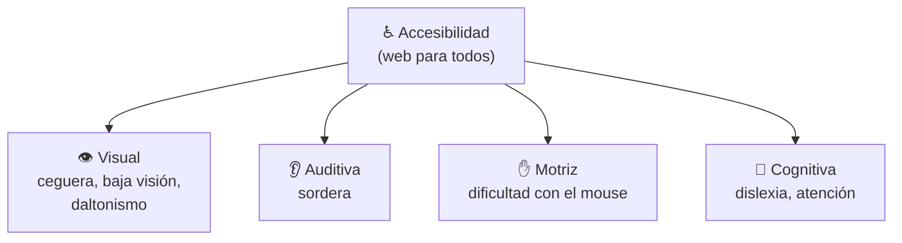
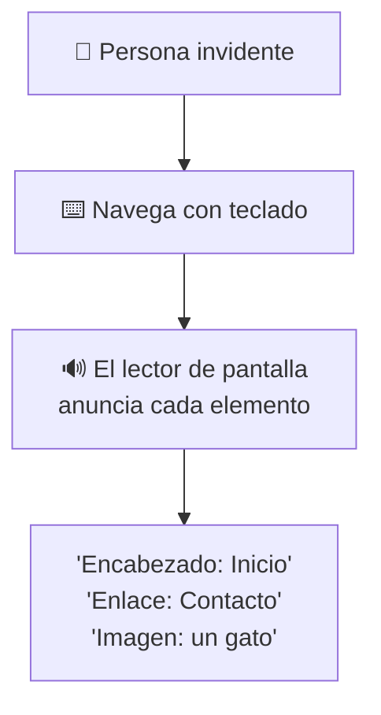
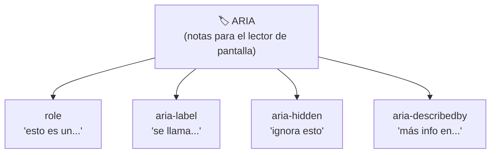
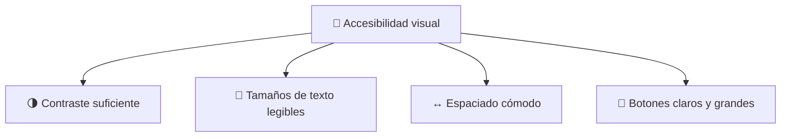
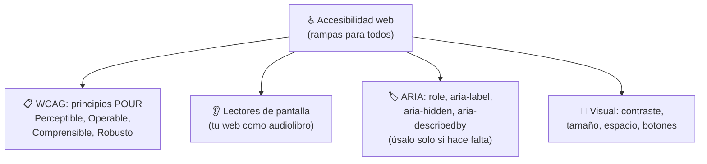

# ♿ MÓDULO 10 — Accesibilidad Web Moderna

> **Objetivo del módulo:** Entender cómo construir sitios inclusivos… páginas que _todas_ las personas puedan usar, sin importar cómo vean, oigan o se muevan.

A lo largo del curso hemos ido sembrando accesibilidad: el `alt` de las imágenes (Módulo 5), la navegación por teclado (Módulo 8), los `<label>` de los formularios (Módulo 9). Hoy juntamos todas esas piezas y vemos el panorama completo. Este no es un módulo "técnico más": es el que convierte tu web en algo **justo y para todos**.

La metáfora de este módulo: 🛗 **la accesibilidad web es como las rampas y ascensores de un edificio.** Una rampa no le estorba a quien usa las escaleras, pero le cambia la vida a quien va en silla de ruedas. Y al final, las rampas, los ascensores y los letreros claros hacen el edificio **mejor para todos**: para el que lleva un coche de bebé, una maleta pesada o simplemente va con prisa. La web accesible funciona igual.

---

## ♿ Qué es accesibilidad

**Accesibilidad** (a veces abreviada "a11y") significa diseñar tu página para que **cualquier persona pueda usarla**, incluyendo a quienes tienen alguna discapacidad: visual, auditiva, motriz o cognitiva.

No es un "extra para unos pocos". Piénsalo: una persona puede tener una discapacidad permanente (ceguera), temporal (un brazo enyesado) o situacional (sostener al bebé con un brazo mientras navega con el otro). En algún momento, **todos** nos beneficiamos de una web accesible.



### Qué son las WCAG

Las **WCAG** (Pautas de Accesibilidad para el Contenido Web) son **el manual oficial** que dice cómo hacer una web accesible. Es la guía mundialmente aceptada, creada por los organismos que estandarizan Internet.

No necesitas memorizarlas, pero sí conocer su corazón: las WCAG se resumen en **cuatro principios**, fáciles de recordar con la sigla **POUR** (que en inglés significa "verter"):

|Principio|Significa que tu web debe ser…|Ejemplo|
|---|---|---|
|**P**erceptible|Poder **percibirse** (verse u oírse)|Imágenes con `alt`, videos con subtítulos|
|**O**perable|Poder **manejarse** (con mouse o teclado)|Navegación con TAB (Módulo 8)|
|**U**nderstandable (comprensible)|Poder **entenderse** fácilmente|Textos claros, errores explicados|
|**R**obusto|Funcionar en **distintos dispositivos** y tecnologías|HTML bien escrito que lean los lectores de pantalla|

> 💡 **Tranquilo:** no tienes que estudiarte las WCAG de memoria. Lo que ya has aprendido en este curso (HTML semántico, `alt`, `label`, navegación por teclado) **ya cumple buena parte de ellas**. La accesibilidad no es un tema aparte; es escribir buen código.

### Por qué importa

Por tres razones, todas de peso. Primero, lo **humano**: hay millones de personas con discapacidad en el mundo, y excluirlas de tu web es excluir a personas reales. Segundo, lo **legal**: en muchos países la accesibilidad web es **obligatoria por ley**, y las empresas han sido demandadas por no cumplirla. Tercero, lo **práctico**: una web accesible suele tener mejor SEO, ser más usable y llegar a más público. Hacer lo correcto, además, conviene.

---

## 👂 Lectores de pantalla

Un **lector de pantalla** es un programa que **lee la página en voz alta** para personas ciegas o con baja visión. Convierte lo que está en la pantalla en sonido. Entender cómo funciona te ayuda a escribir código que suene bien al oído, no solo que se vea bien.

### Cómo navega una persona invidente

Una persona que no puede ver **no "mira" la página de un vistazo**: la escucha de forma lineal, elemento por elemento, y usa el teclado para saltar entre partes. El lector de pantalla le anuncia cada cosa: "Encabezado nivel 1: Mi Blog. Enlace: Inicio. Imagen: gato durmiendo. Campo de texto: tu correo".



> 🎧 **Metáfora:** imagina escuchar un **audiolibro de tu página** en lugar de verla. Si el audiolibro dice "imagen, imagen, imagen, enlace, enlace" sin explicar qué son, te pierdes por completo. Pero si dice "imagen de un gato naranja, enlace a la página de contacto", todo cobra sentido. Tu trabajo es escribir HTML que se convierta en un _buen_ audiolibro.

Aquí se conecta TODO lo aprendido: el `alt` le dice al lector qué muestra una imagen, los encabezados (`<h1>`-`<h6>`) le permiten saltar entre secciones como un índice, las etiquetas semánticas (`<nav>`, `<main>`) le dicen en qué zona está, y los `<label>` le explican cada campo. **Un HTML bien escrito ya es, en gran parte, accesible.**

---

## 🏷 Introducción a ARIA

**ARIA** (Accessible Rich Internet Applications) es un conjunto de **atributos extra** que añaden información de accesibilidad cuando el HTML normal no alcanza. Son como **notas para el lector de pantalla** que el ojo no ve, pero el oído sí recibe.

> ⚠️ **La regla #1 de ARIA (muy importante):** _"No usar ARIA es mejor que usar ARIA mal."_ Siempre prefiere una etiqueta HTML semántica de verdad (un `<button>` real, un `<nav>` real) antes que parchearlo con ARIA. ARIA es el **último recurso**, no el primero. Úsalo solo cuando el HTML no te da otra opción.

Veamos los cuatro atributos más comunes:



### `role` — Qué es algo

`role` le dice al lector de pantalla **qué función cumple un elemento**, cuando no es evidente. Por ejemplo, si por necesidad usaste un `<div>` como botón (no recomendado, pero pasa), `role="button"` avisa "esto en realidad es un botón".

```html
<div role="button">Haz clic aquí</div>
```

> 🏷️ **Metáfora:** `role` es como ponerle una **placa de cargo** a alguien. Aunque no lleve uniforme, la placa dice "soy el guardia de seguridad". Aclara la función de algo que visualmente es ambiguo.

### `aria-label` — El nombre invisible

Ya lo conociste en el Módulo 9: da un **nombre que solo el lector de pantalla escucha**, útil para elementos sin texto visible (un botón que es solo un ícono).

```html
<button aria-label="Cerrar ventana">✕</button>
```

Sin el `aria-label`, el lector solo diría "equis"; con él, dice "Cerrar ventana". Mucho más claro.

### `aria-hidden` — Ignora esto

`aria-hidden="true"` le dice al lector de pantalla **"sáltate este elemento"**. Se usa para cosas puramente decorativas (un ícono adorno) que, si se leyeran, solo causarían ruido y confusión.

```html
<span aria-hidden="true">🎨</span> Diseño
```

> 🔇 **Metáfora:** `aria-hidden` es como poner en **silencio** una parte de la página. El emoji decorativo se ve, pero el lector no lo anuncia, para no decir "paleta de pintura" cuando solo es un adorno.

### `aria-describedby` — Más información

`aria-describedby` **conecta un elemento con un texto que lo describe** en más detalle, como una nota al pie. Le dice al lector: "para más info sobre esto, lee aquello".

```html
<input type="password" aria-describedby="ayuda-clave">
<p id="ayuda-clave">La contraseña debe tener al menos 8 caracteres.</p>
```

Cuando el usuario llega al campo, el lector lee también esa pista. Funciona como el `for`/`id` de los formularios: conecta dos elementos por su `id`.

|Atributo ARIA|Le dice al lector…|Cuándo usarlo|
|---|---|---|
|`role`|"esto es un [botón, menú...]"|Cuando la función no es clara|
|`aria-label`|"se llama [nombre]"|Elementos sin texto visible|
|`aria-hidden`|"ignora esto"|Adornos decorativos|
|`aria-describedby`|"más detalles en [id]"|Añadir una explicación extra|

---

## 🎨 Accesibilidad visual

No toda la accesibilidad es para personas ciegas. Mucha gente **ve, pero con dificultad**: baja visión, daltonismo, o simplemente leer en un celular bajo el sol. Estos cuidados visuales benefician a todos.



### Contraste

El **contraste** es la diferencia entre el color del texto y el del fondo. Un texto gris claro sobre fondo blanco es casi imposible de leer para mucha gente. El texto debe **destacar claramente** sobre su fondo.

> 🌗 **Metáfora:** piensa en leer bajo el sol del mediodía. Un texto con buen contraste (negro sobre blanco) se lee sin esfuerzo; uno con poco contraste (gris sobre gris) desaparece. Las WCAG incluso definen una proporción mínima de contraste, pero la regla práctica es simple: **si tú tienes que entrecerrar los ojos, está mal.**

### Tamaños de texto

El texto debe ser **lo bastante grande** para leerse cómodamente, y debe poder **agrandarse** si el usuario lo necesita (mucha gente aumenta el zoom). Un texto diminuto excluye a quien tiene baja visión y cansa a todos.

### Espaciado

El **espacio entre líneas, párrafos y elementos** ayuda a que el ojo no se pierda. Un texto apretado, sin aire, es agotador y difícil de seguir, sobre todo para personas con dislexia. El espacio en blanco no es "desperdicio": es respiración para la lectura.

### Botones accesibles

Un buen botón es **fácil de identificar y de pulsar**: debe parecer un botón (no un texto cualquiera), ser **lo bastante grande** para tocarlo con el dedo en un celular, y tener buen contraste. Un botón minúsculo o que no parece clicable frustra a todos, y especialmente a quien tiene dificultades motrices.

> 👆 **Metáfora:** un botón accesible es como el **botón de un ascensor**: grande, visible, claramente pulsable, y que confirma cuando lo presionas. Nadie debería dudar de si algo es un botón o cómo activarlo.

---

## 🔬 Compruébalo tú mismo

Dos experimentos reveladores. **Uno:** intenta navegar tu sitio (o cualquiera) **solo con el teclado**, como en el Módulo 8: ¿puedes llegar a todo? **Dos:** la mayoría de los sistemas operativos traen un lector de pantalla integrado (VoiceOver en Mac, Narrador en Windows). Actívalo unos minutos, cierra los ojos e intenta usar una página. Será incómodo al principio, pero **vivirás en carne propia** lo que experimenta una persona invidente. Pocas cosas te harán mejor desarrollador que esa experiencia.

---

## 📝 Resumen del Módulo 10



En resumen, hoy entendiste que la **accesibilidad** es construir rampas digitales que hacen tu web usable para todos, sea su discapacidad permanente, temporal o situacional. Conociste las **WCAG** y su corazón **POUR** (Perceptible, Operable, Comprensible, Robusto), y descubriste que el buen HTML que ya sabes escribir _ya cumple buena parte_. Aprendiste cómo navega una persona invidente con un **lector de pantalla** (tu web convertida en audiolibro) y por qué el `alt`, los encabezados y los `<label>` son tan importantes. Conociste **ARIA** (`role`, `aria-label`, `aria-hidden`, `aria-describedby`) con su regla de oro: _úsalo solo cuando el HTML no alcance_. Y cuidaste la **accesibilidad visual**: contraste suficiente, texto legible, buen espaciado y botones claros.

> 🚀 **Siguiente paso:** Has cerrado el dominio del HTML al más alto nivel: estructurado, semántico, optimizado, interactivo y **accesible para toda la humanidad**. Pocos cursos llegan tan lejos en este aspecto. Ahora sí estás listo para el gran salto al **diseño visual con CSS**, donde aprenderás a hacer que todo esto, además de correcto, se vea espectacular. ¡Felicidades por construir con conciencia!