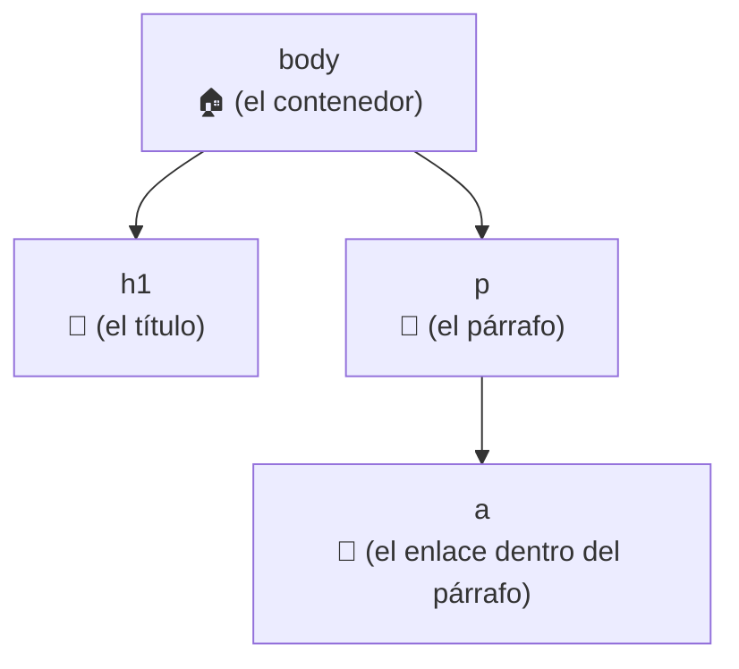
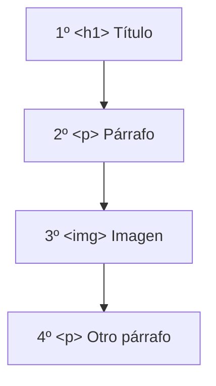
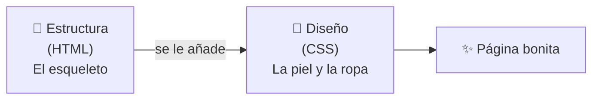
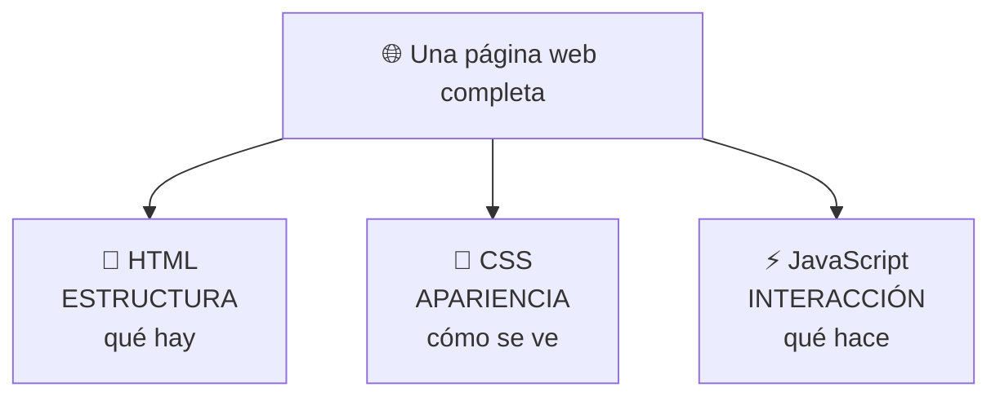
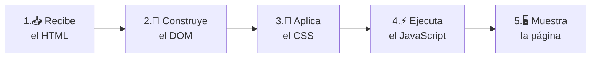
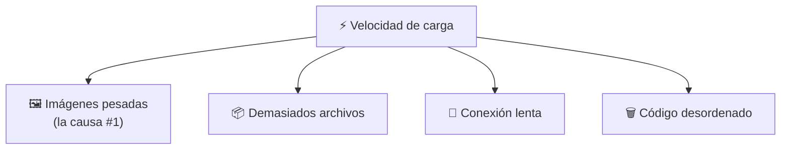
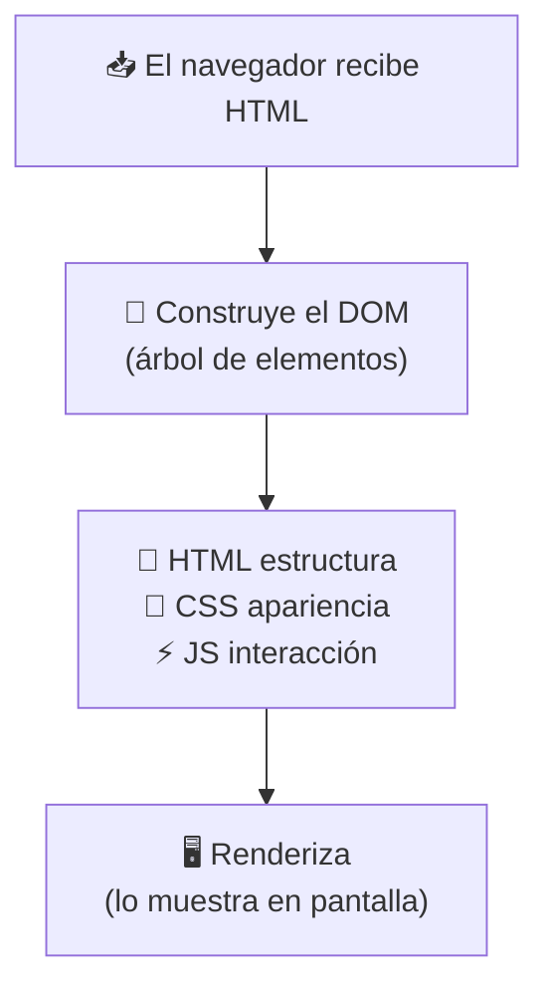

# 📙 MÓDULO 3 — Cómo Piensa el Navegador

> **Objetivo del módulo:** Comprender qué ocurre realmente cuando abrimos una página… para que el navegador deje de ser una caja misteriosa y se convierta en tu aliado.

Hasta ahora aprendiste a escribir HTML (Módulo 2) y a entender dónde vive la web (Módulo 1). Pero, ¿qué pasa **dentro** del navegador cuando abres una página? En este módulo abrimos esa caja y miramos sus engranajes. Tranquilo: lo veremos como una historia, no como un manual técnico.

La metáfora de este módulo: 🏗️ **el navegador es como un equipo de construcción que lee los planos y levanta la casa frente a tus ojos.** Tú entregas las instrucciones (el código) y él construye lo que ves.

---

## 🧠 Cómo el navegador interpreta HTML

Cuando le entregas un archivo HTML al navegador, él no lo muestra "tal cual". Primero lo **lee de arriba a abajo**, lo entiende y construye una versión organizada en su memoria. Solo después lo dibuja en pantalla.

Es como un constructor que recibe los planos de una casa: primero los lee completos, entiende cuántas habitaciones hay y cómo se conectan, y _luego_ empieza a construir.

### ¿Qué es el DOM?

El **DOM** (Document Object Model) suena aterrador, pero la idea es simple: es el **mapa ordenado que el navegador arma en su memoria** a partir de tu HTML.

Cuando el navegador lee tus etiquetas, las organiza como un **árbol genealógico**: hay elementos "padres" que contienen "hijos", y esos hijos pueden tener sus propios hijos. Ese árbol es el DOM.

Mira este HTML sencillo:

```html
<body>
  <h1>Mi título</h1>
  <p>Un párrafo con un <a href="#">enlace</a>.</p>
</body>
```

El navegador lo convierte en este árbol mental:



Fíjate cómo el enlace `<a>` es "hijo" del párrafo `<p>`, porque estaba **dentro** de él. Así es como el navegador entiende qué cosa contiene a qué otra. El DOM es, básicamente, tu HTML transformado en una estructura que el navegador puede manejar y modificar.

> 💡 **¿Por qué importa el DOM?** Porque más adelante, cuando uses JavaScript para hacer cosas interactivas (cambiar un texto al hacer clic, por ejemplo), en realidad estarás **modificando el DOM**. Es el tablero sobre el que se juega todo.

### Cómo aparecen los elementos en pantalla

El navegador dibuja los elementos **en el orden en que los escribiste**, de arriba hacia abajo, como si apilara bloques uno encima del otro.



Si escribes primero el título y luego el párrafo, así aparecerán: título arriba, párrafo abajo. El navegador respeta tu orden como un cocinero respeta los pasos de una receta. Esto te da una herramienta poderosa: **el orden de tu código es el orden de tu página.**

### Diferencia entre estructura y diseño

Aquí hay un concepto que libera mucho a los principiantes: **lo que escribes y lo que se ve no son lo mismo.**

La **estructura** es el esqueleto (tu HTML): qué elementos hay y cómo se organizan. El **diseño** es la apariencia: colores, tamaños, posiciones. Por defecto, el HTML solo, sin diseño, se ve **simple y feo**: texto negro, fondo blanco, todo apilado. Y eso está bien, porque la estructura es lo primero.



> 🏠 **Volviendo a la casa:** la estructura es donde van las paredes y las habitaciones; el diseño es la pintura, los muebles y la decoración. Una casa recién construida sin pintar sigue siendo perfectamente funcional. Primero se levanta, después se decora.

---

## ⚡ Cómo se conectan HTML, CSS y JavaScript

Toda página web moderna se sostiene sobre **tres tecnologías** que trabajan juntas como un equipo. Cada una tiene un trabajo claro y no se pisan entre sí. Esta es quizá la idea más importante de todo el módulo.



### HTML = estructura

El HTML es el **esqueleto**. Define qué elementos existen y en qué orden: títulos, párrafos, imágenes, botones. Sin HTML no hay nada que mostrar ni decorar. Es la base obligatoria.

### CSS = apariencia

El CSS (lo verás más adelante en el curso) es **la ropa y el maquillaje** de la página. Toma tu estructura simple y le da vida: colores, tipos de letra, tamaños, espacios, posiciones. El mismo HTML puede verse como una página de los años 90 o como un sitio moderno y elegante, dependiendo solo del CSS.

### JavaScript = interacción

El JavaScript es **el músculo y el movimiento**. Hace que la página _reaccione_: que un botón abra un menú, que un formulario valide tus datos, que aparezca una alerta. Es lo único de los tres que realmente "programa" y toma decisiones.

Una analogía que lo deja clarísimo, **el cuerpo humano**:

|Tecnología|Parte del cuerpo|Qué aporta|
|---|---|---|
|🦴 **HTML**|Los huesos|La estructura que sostiene todo|
|🎨 **CSS**|La piel y la ropa|La apariencia, lo que se ve|
|⚡ **JavaScript**|Los músculos|El movimiento y las reacciones|

Un cuerpo necesita huesos primero (HTML). Puede existir con huesos y piel pero sin moverse (HTML + CSS). Y con músculos, ya se mueve y reacciona (HTML + CSS + JavaScript). **Siempre se construye en ese orden.**

---

## 📦 Renderizado básico

"Renderizar" es la palabra técnica para **"convertir el código en lo que ves en pantalla"**. Ya lo nombramos en el Módulo 2; ahora veremos _cómo_ ocurre y por qué a veces una página tarda en cargar.

### Cómo carga una página

Cuando abres una página, el navegador no recibe todo de golpe. Sigue una secuencia de pasos, como armar un mueble siguiendo el instructivo:



Paso a paso, en lenguaje humano:

1. **Recibe el HTML** desde el servidor (recuerda la cocina del Módulo 1).
2. **Construye el DOM**, ese árbol ordenado en su memoria.
3. **Aplica el CSS** para darle color y forma a cada elemento.
4. **Ejecuta el JavaScript** para activar las interacciones.
5. **Muestra (renderiza)** el resultado final en tu pantalla.

Todo esto suele pasar en **menos de un segundo**. Cuando una página "tarda en cargar", es que alguno de estos pasos se está demorando.

### Qué afecta la velocidad

La velocidad de una página depende de cuánto "trabajo" le des al navegador. Estos son los factores más comunes que la hacen lenta:

Las **imágenes muy pesadas** son la causa número uno: una foto enorme tarda mucho en descargarse, como intentar pasar un sofá por una puerta pequeña. Tener **demasiados archivos** (muchas imágenes, muchos estilos, mucho código) también suma tiempo, porque el navegador debe pedirlos y esperarlos todos. Una **conexión a Internet lenta** retrasa la llegada de todo. Y un **código desordenado o excesivo** obliga al navegador a trabajar de más.



> 💡 **Regla práctica para el futuro:** una página rápida casi siempre es una página _ligera y ordenada_. No necesitas saber optimización avanzada todavía; basta con recordar que **menos peso = más velocidad**, y que las imágenes son lo primero que conviene cuidar.

---

## 🔬 Compruébalo tú mismo

No te quedes con la teoría. Abre cualquier página, haz **clic derecho → Inspeccionar** (las DevTools del Módulo 1) y verás el **DOM real** de esa página: ese árbol de elementos que el navegador construyó. Pasa el cursor sobre las líneas de código y se iluminará la parte correspondiente en la pantalla. Ahí estás viendo, en vivo, exactamente lo que explicamos en este módulo.

---

## 📝 Resumen del Módulo 3



En resumen, hoy entendiste qué pasa "tras bambalinas": el navegador lee tu HTML y arma el **DOM**, un árbol ordenado de elementos en su memoria, como un constructor que estudia los planos antes de levantar la casa. Los elementos **aparecen en el orden** en que los escribiste, y la **estructura** (HTML) es distinta del **diseño** (CSS): primero se construye, después se decora. Toda página se apoya en tres tecnologías que trabajan como un cuerpo humano: **HTML (huesos), CSS (piel) y JavaScript (músculos)**. Y el **renderizado** sigue una secuencia de pasos cuya velocidad depende sobre todo del peso de la página, siendo las **imágenes pesadas** el factor que más la frena.

> 🚀 **Siguiente paso:** Ya sabes cómo piensa el navegador. Con esta base, todo lo que escribas a partir de ahora tendrá sentido, porque entenderás _qué hace el navegador con tu código_. ¡Vamos a seguir construyendo!