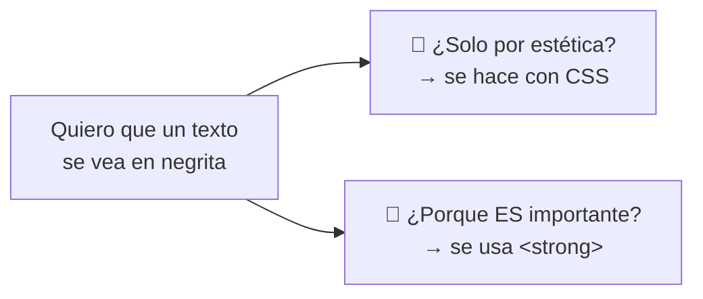
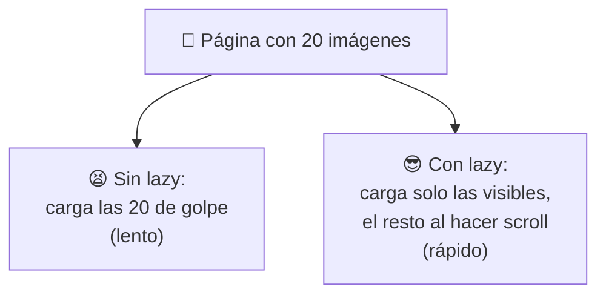
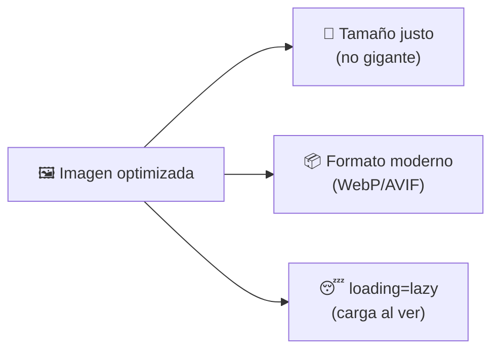
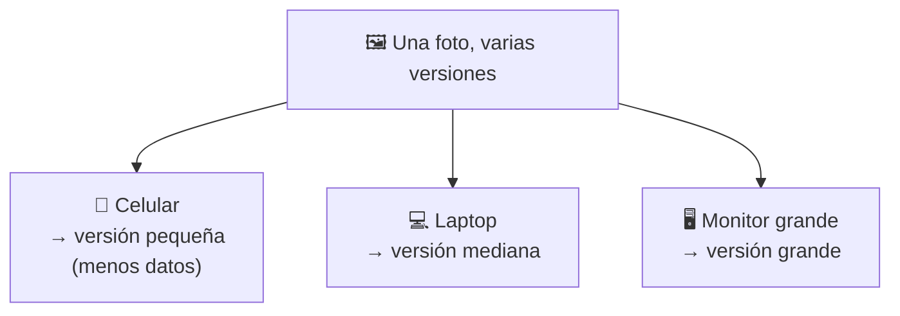
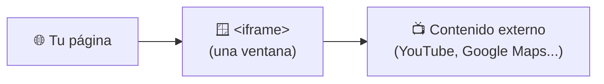
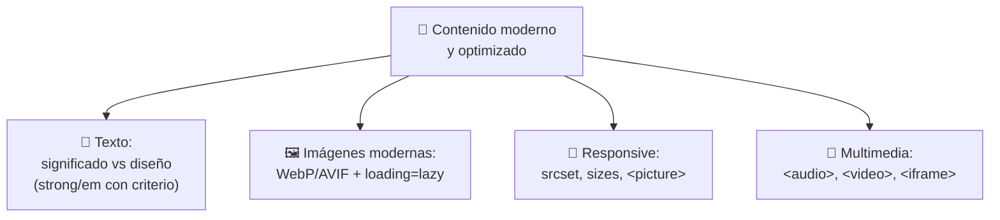

# 📷 MÓDULO 7 — Contenido Inteligente y Multimedia

> **Objetivo del módulo:** Aprender a trabajar contenido moderno y optimizado… para que tu página sea rápida, se vea bien en cualquier pantalla y cargue imágenes, audio y video como los sitios actuales.

En los módulos anteriores construiste, amueblaste y organizaste tu casa con criterio profesional. Ahora vamos a equiparla con **tecnología moderna**: imágenes inteligentes que pesan poco, fotos que se adaptan a cada pantalla, y multimedia como audio y video. Este es el módulo que separa una web "del 2010" de una web actual.

La metáfora de este módulo: 🎒 **el contenido moderno es como empacar inteligente para un viaje.** No metes la maleta más grande "por si acaso": llevas justo lo necesario, en el formato más ligero, y sacas cada cosa solo cuando la necesitas. Eso es exactamente lo que hace una web optimizada.

---

## 📝 Texto accesible

Antes de las imágenes, cerremos un tema del texto que quedó pendiente y que define a un buen desarrollador: la diferencia entre **cómo se ve** algo y **qué significa**.

### Diferencia entre diseño y significado

Esta distinción es sutil pero importantísima. Hay etiquetas que cambian la **apariencia** y etiquetas que comunican **significado**, aunque a veces se vean igual en pantalla.



> 🎭 **Metáfora:** el diseño es el _vestuario_ de un actor (cómo luce); el significado es el _guion_ (qué papel cumple). Dos personajes pueden vestir igual, pero el guion dice quién es el protagonista. En HTML, el "guion" es lo que leen Google y los lectores de pantalla.

La regla práctica: si quieres algo en negrita **solo porque se ve bonito**, eso es trabajo del CSS (lo verás más adelante). Si lo quieres en negrita **porque de verdad es importante**, usa una etiqueta con significado.

### Uso correcto de `<strong>` y `<em>`

Ya las conociste en el Módulo 5; ahora las usamos _con criterio_. La clave es que estas etiquetas no son "para poner negrita o cursiva", son **para comunicar importancia y énfasis**:

```html
<p>
  <strong>Advertencia:</strong> no toques el cable.
  Esto es <em>realmente</em> peligroso.
</p>
```

`<strong>` significa "esto es importante o urgente" y se ve en negrita. `<em>` significa "esto lleva un énfasis especial" (como cuando subes el tono al hablar) y se ve en cursiva.

|Quiero…|Uso|Por qué|
|---|---|---|
|Marcar algo **importante**|`<strong>`|Comunica importancia + se ve en negrita|
|Dar **énfasis** de voz|`<em>`|Comunica énfasis + se ve en cursiva|
|Solo **decorar** sin significado|CSS (más adelante)|La apariencia no es asunto del HTML|

> 💡 **Por qué importa:** un lector de pantalla _pronuncia distinto_ el texto en `<strong>` y `<em>`, dándole la entonación que merece. Si usas negrita "decorativa" con estas etiquetas sin querer, le mientes al programa. Usa cada etiqueta para lo que significa.

---

## 🖼 Imágenes modernas

Las imágenes suelen ser **lo más pesado** de una página (lo vimos en el Módulo 3: son la causa #1 de lentitud). La buena noticia: con técnicas modernas, pesan muchísimo menos sin perder calidad.

### Formatos modernos (`webp`, `avif`)

Un "formato" es la **manera en que se guarda** una imagen. Los clásicos son `JPG` y `PNG`, pero hoy existen formatos más nuevos e inteligentes:

|Formato|Cómo es|Cuándo usarlo|
|---|---|---|
|`JPG`|El clásico, pesa más|Compatible con todo, pero anticuado|
|`PNG`|Bueno para logos/transparencias, pesa mucho|Cuando necesitas fondo transparente|
|`WebP` 🆕|Misma calidad, **mucho menos peso**|La opción moderna recomendada|
|`AVIF` 🆕|Aún más ligero que WebP|Lo más nuevo y eficiente|

> 📦 **Metáfora:** imagina enviar la misma ropa en dos maletas. El `JPG` es una maleta vieja y voluminosa; el `WebP` es una maleta moderna al vacío que guarda **lo mismo** ocupando la mitad. El contenido es idéntico; lo que cambia es cuánto pesa al viajar por Internet.

La idea para recordar: **usa WebP o AVIF siempre que puedas**. Tu página cargará más rápido y tus visitantes lo agradecerán (¡y Google también, porque la velocidad mejora el SEO!).

### `loading="lazy"` — Cargar solo lo necesario

Esta es una de las técnicas modernas más fáciles y poderosas. Por defecto, el navegador intenta cargar **todas** las imágenes de golpe, incluso las que están al final y el usuario quizá nunca verá. `loading="lazy"` cambia eso:

```html

```

Con `lazy` ("perezoso"), la imagen **solo se carga cuando el usuario está a punto de verla** al hacer scroll. Las de abajo esperan pacientes hasta que haces scroll hacia ellas.



> 🍽️ **Metáfora:** es como un **buffet por plato**. En vez de servirte los 20 platos a la vez (y que se enfríen), te traen cada uno justo cuando vas a comerlo. Sirve solo lo que el comensal va a consumir en ese momento.

### Optimización básica

No necesitas ser experto para tener imágenes optimizadas. Con tres hábitos sencillos ya marcas una gran diferencia: **reduce el tamaño** de la imagen antes de subirla (no subas una foto de 4000 píxeles si la mostrarás a 400), **usa formatos modernos** como WebP, y **aplica `loading="lazy"`** a las imágenes que no se ven de inmediato. Estos tres gestos, sin nada complejo, hacen que tu página vuele.



---

## 📱 Imágenes responsive

"Responsive" significa que algo **se adapta** a la pantalla donde se ve. Una imagen responsive se muestra en el tamaño adecuado tanto en un celular pequeño como en un monitor enorme, **sin desperdiciar datos**. ¿Para qué enviar una imagen gigante a un celular diminuto?

La idea central: en lugar de dar _una_ imagen para todos, le ofreces al navegador **varias versiones** y dejas que elija la mejor según la pantalla.



### `srcset` — El menú de opciones

`srcset` te permite ofrecer **varias versiones del mismo archivo** en distintos tamaños. El navegador escoge la más adecuada solito.

```html

```

> 📋 **Metáfora:** `srcset` es un **menú de tallas** (S, M, L). Tú las pones todas en la mesa y el navegador, como un cliente inteligente, elige la talla que le queda bien según su pantalla. No le das ropa de gigante a un niño.

### `sizes` — La pista para elegir

`sizes` ayuda al navegador diciéndole **cuánto espacio ocupará** la imagen en pantalla, para que elija aún mejor de tu `srcset`.

```html

```

En palabras simples, ese `sizes` dice: "si la pantalla es pequeña (menos de 600px), la imagen ocupará 480px; si no, ocupará 1200px". Con esa pista, el navegador acierta con la versión ideal. No te preocupes por dominar la sintaxis ahora; basta con entender que **`sizes` es la pista que ayuda a elegir bien**.

### `<picture>` — Control total

`<picture>` es la herramienta más completa: te deja mostrar **imágenes completamente distintas** según la situación, no solo tamaños distintos. Por ejemplo, una foto horizontal en computadora y una vertical en celular.

```html
<picture>
  <source media="(max-width: 600px)" srcset="foto-vertical.webp">
  <source media="(min-width: 601px)" srcset="foto-horizontal.webp">
  
</picture>
```

> 🎬 **Metáfora:** `<picture>` es como un **director de cine** que elige qué toma usar según la sala. En la sala pequeña (celular) proyecta la versión vertical; en la grande (monitor), la horizontal. Siempre incluyes un `` al final como **plan B**, por si el navegador no soporta lo demás.

|Herramienta|Para qué sirve|Metáfora|
|---|---|---|
|`srcset`|Varias **tallas** de la misma imagen|Menú de tallas S/M/L|
|`sizes`|**Pista** del espacio que ocupará|Decirle la talla al sastre|
|`<picture>`|Imágenes **distintas** según el caso|Director que elige la toma|

---

## 🎥 Multimedia

Tu página no se limita a texto e imágenes. Puedes incluir **sonido, video y contenido de otros sitios** con tres etiquetas sencillas.

### `<audio>` — Sonido

Reproduce archivos de audio (música, podcasts, efectos). El atributo `controls` muestra los botones de play, pausa y volumen:

```html
<audio src="cancion.mp3" controls></audio>
```

Es como **empotrar un reproductor de música** dentro de tu página. Con `controls`, el usuario ve los botones; sin él, el reproductor queda oculto.

### `<video>` — Video

Funciona igual que `<audio>`, pero para video. También usa `controls`, y puedes definir su tamaño:

```html
<video src="tutorial.mp4" controls width="600"></video>
```

> 📺 **Metáfora:** `<audio>` y `<video>` son como **empotrar un televisor o una radio** en la pared de tu casa. Tú decides dónde van y si traen mando a distancia (`controls`) para que el visitante los maneje.

### `<iframe>` — Una ventana a otro sitio

`<iframe>` es especial: muestra **contenido de otra página dentro de la tuya**, como una ventana hacia afuera. Su uso más común es **incrustar videos de YouTube, mapas de Google o publicaciones de redes sociales**.

```html
<iframe src="https://www.youtube.com/embed/VIDEO_ID" width="560" height="315"></iframe>
```



> 🪟 **Metáfora:** un `<iframe>` es una **ventana en la pared de tu casa que da al jardín del vecino**. Tú no construiste ese jardín (el video de YouTube, el mapa), pero lo muestras dentro de tu espacio a través del marco de la ventana. Por eso casi nunca subes videos pesados a tu propio sitio: los incrustas desde YouTube y dejas que ellos carguen el peso.

---

## 🔬 Compruébalo tú mismo

Entra a cualquier sitio moderno con muchas fotos (una tienda online, por ejemplo), haz **clic derecho → Inspeccionar** sobre una imagen y busca atributos como `srcset`, `loading="lazy"` o formatos `.webp`. Verás que los sitios profesionales **no usan imágenes simples**: aplican exactamente estas técnicas para cargar rápido. Y si ves un video incrustado, revisa si es un `<iframe>` apuntando a YouTube. ¡Es la teoría de hoy funcionando en producción!

---

## 📝 Resumen del Módulo 7



En resumen, hoy modernizaste tu contenido: entendiste la diferencia entre **diseño** (cómo se ve, asunto del CSS) y **significado** (qué es, asunto del HTML), usando `<strong>` y `<em>` con criterio. Aprendiste a hacer imágenes ligeras con **formatos modernos** (WebP, AVIF) y `loading="lazy"` para cargar solo lo necesario. Descubriste las imágenes **responsive** con `srcset` (varias tallas), `sizes` (la pista para elegir) y `<picture>` (control total para imágenes distintas). Y sumaste **multimedia** con `<audio>`, `<video>` e `<iframe>` (esa ventana al jardín del vecino para incrustar YouTube o mapas).

> 🚀 **Siguiente paso:** Con esto, tu HTML está completo y moderno: estructurado, semántico, accesible y optimizado. Has terminado de dominar la **estructura** de la web. Lo que viene es el lado más visual y creativo: darle estilo, color y diseño con **CSS**. ¡Prepárate para que tus páginas dejen de verse simples y empiecen a verse increíbles!