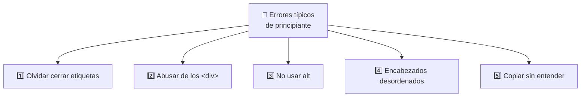
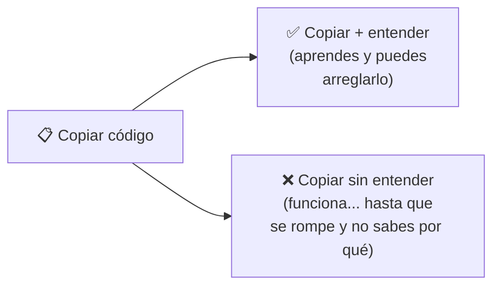
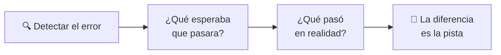
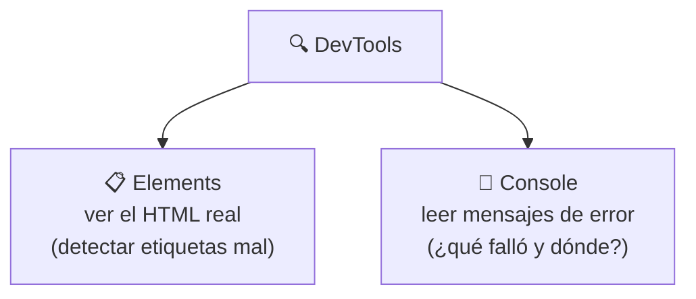
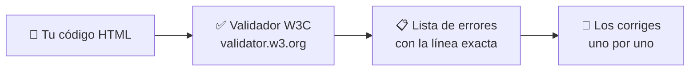
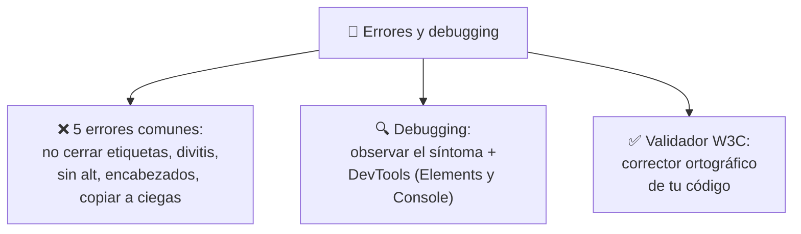

# 🐛 MÓDULO 12 — Errores Reales que Cometen los Principiantes

> **Objetivo del módulo:** Evitar malos hábitos desde el inicio… y aprender a encontrar y arreglar errores sin frustrarte.

¿Recuerdas la filosofía del Módulo 1? **Equivocarse es parte del proceso.** Este módulo lo lleva a la práctica: vamos a ver los errores más comunes de los principiantes (los cometerás, y está bien) y, sobre todo, a aprender a **detectarlos y corregirlos** como un profesional. Porque la diferencia entre un novato y un experto no es que el experto no se equivoque: es que **sabe encontrar y arreglar sus errores rápido**.

La metáfora de este módulo: 🔍 **arreglar errores es como ser un detective.** El código no funciona, hay un "misterio", y tú buscas pistas hasta encontrar al culpable. No te enojas con el caso; lo resuelves con calma y método. Bienvenido a tu trabajo de detective.

---

## ❌ Errores comunes

Estos cinco errores los comete **absolutamente todo el mundo** al empezar. Conocerlos de antemano es como tener el mapa de las trampas: sabrás esquivarlas o, al menos, reconocerlas al instante.



### 1️⃣ Olvidar cerrar etiquetas

Recuerda del Módulo 2 que la mayoría de etiquetas van **en pareja** (abren y cierran). Olvidar el cierre es el error #1, y desordena toda la página porque el navegador no sabe dónde termina cada cosa.

```html
<!-- ❌ Mal: el párrafo nunca cierra -->
<p>Este texto no tiene fin

<!-- ✅ Bien -->
<p>Este texto sí cierra correctamente</p>
```

> 🤗 **Recuerda la metáfora del abrazo:** toda etiqueta que abre un abrazo debe soltarlo. Si abres `<p>` y no pones `</p>`, dejas a tu página atrapada en un abrazo eterno.

### 2️⃣ Abusar de los `<div>`

El famoso **"divitis"** del Módulo 6: usar `<div>` para todo en vez de etiquetas semánticas (`<header>`, `<nav>`, `<main>`...). No rompe la página visualmente, pero la vuelve confusa para Google, los lectores de pantalla y otros desarrolladores.

```html
<!-- ❌ Mal -->
<div class="menu">...</div>

<!-- ✅ Bien -->
<nav>...</nav>
```

> 💊 La cura ya la conoces: antes de un `<div>`, pregúntate si existe una etiqueta con significado que encaje mejor.

### 3️⃣ No usar `alt`

Omitir el `alt` de las imágenes (Módulo 5) deja a las personas ciegas sin saber qué muestra la foto, y le quita información a Google. Es uno de los errores de accesibilidad más frecuentes y más fáciles de evitar.

```html
<!-- ❌ Mal -->


<!-- ✅ Bien -->

```

### 4️⃣ Encabezados mal organizados

Saltarse niveles de encabezado (pasar de `<h1>` a `<h4>` por estética) o usar varios `<h1>` rompe la jerarquía que aprendiste en los Módulos 5 y 6. Confunde a Google sobre la estructura de tu contenido.

```html
<!-- ❌ Mal: salta de h1 a h4 -->
<h1>Título</h1>
<h4>Subtítulo</h4>

<!-- ✅ Bien: orden lógico -->
<h1>Título</h1>
<h2>Subtítulo</h2>
```

> 📚 Recuerda: los encabezados son el **índice de un libro**. Deben ir en orden, sin saltarse capítulos.

### 5️⃣ Copiar código sin entender

Este es el error más peligroso **a largo plazo**. Copiar y pegar código de Internet no tiene nada de malo (¡los profesionales lo hacen!), pero copiarlo **sin entender qué hace** te deja indefenso cuando algo falla, porque no sabes qué tocar.



> 💡 **El hábito correcto:** copia si quieres, pero luego pregúntate _"¿qué hace cada línea de esto?"_. Si no lo sabes, investígalo. Recuerda la filosofía del curso: googlear es normal, pero entender es lo que te hace crecer.

---

## 🛠 Debugging básico

"Debugging" (depuración) es el nombre técnico de **buscar y arreglar errores** en el código. La palabra viene de "bug" (bicho): quitar los bichos de tu código. Aquí empieza tu trabajo de detective.

> 🧘 **Lo primero, la actitud:** un error **no es un fracaso, es una pista**. El navegador no te está regañando; te está ayudando a encontrar el problema. Respira, lee con calma y resuelve. La frustración nubla; la calma resuelve.

### Cómo detectar errores

Los errores se delatan de varias formas: la página **se ve rara** (algo descuadrado, un texto que no aparece), **no funciona** lo que esperabas, o el navegador **muestra un mensaje de error**. Tu primer paso de detective es **observar el síntoma**: ¿qué esperabas que pasara y qué pasó en realidad? Esa diferencia es tu primera pista.



### Uso de DevTools

Tu mejor aliado es la herramienta que conoces desde el Módulo 1: las **DevTools** (clic derecho → Inspeccionar). Para buscar errores tienes dos pestañas clave:

La pestaña **Elements** (Elementos) te muestra tu HTML tal como el navegador lo entendió. Si olvidaste cerrar una etiqueta, aquí lo verás resaltado o descuadrado. La pestaña **Console** (Consola) es el **tablero de mensajes**: ahí el navegador escribe los errores en texto, muchas veces diciéndote _en qué línea_ está el problema.



> 🔦 **Metáfora:** las DevTools son la **lupa del detective**. A simple vista no ves la huella, pero con la lupa aparece clarísima. La consola, además, es como un testigo que te dice "el problema está en la línea 14".

### Validar HTML

"Validar" significa **comprobar que tu código está bien escrito** según las reglas oficiales del HTML. A veces tu página _parece_ funcionar, pero tiene errores escondidos que causarán problemas después. Validar es como una **revisión ortográfica** para tu código: encuentra los fallos que tus ojos pasaron por alto. Para esto existe una herramienta oficial que veremos ahora mismo.

---

## ✅ Validador W3C

El **W3C** es el organismo que define las reglas oficiales de HTML (los mismos que crearon las WCAG del Módulo 10). Tienen un **validador gratuito** que revisa tu código y te señala todos los errores de sintaxis. Es como entregarle tu tarea a un profesor que la corrige al instante.

### Revisar errores reales de sintaxis

Usarlo es muy sencillo:

1. Entra a `https://validator.w3.org`
2. Pega tu código, sube tu archivo, o escribe la dirección de tu página.
3. Pulsa **"Check"** (Revisar).
4. Lee la lista de errores y advertencias que te muestra.



El validador te dice cosas como "falta cerrar la etiqueta en la línea 23" o "este atributo no existe". Cada mensaje señala **dónde** está el problema, para que vayas directo a arreglarlo.

> 📝 **Metáfora:** el validador W3C es el **corrector ortográfico de tu código**. Igual que Word subraya tus faltas de ortografía, el validador subraya tus errores de HTML. No los arregla por ti, pero te dice exactamente dónde están, que es la mitad de la batalla.

> 💡 **Consejo de detective:** arregla los errores **de arriba hacia abajo y de uno en uno**. Muchas veces, un solo error (como una etiqueta sin cerrar) provoca varios mensajes en cascada; al corregir el primero, varios desaparecen solos. No te abrumes con la lista: atácala en orden.

---

## 🔬 Compruébalo tú mismo

Toma cualquier archivo HTML que hayas creado en el curso y pásalo por el validador W3C. Casi seguro encontrará algo (¡le pasa a todos!), y verás lo satisfactorio que es corregir cada punto hasta lograr el mensaje verde de "sin errores". Luego, abre las DevTools en una de tus páginas, ve a la Consola y observa si hay mensajes. Estás practicando el trabajo de detective que harás durante toda tu carrera.

---

## 📝 Resumen del Módulo 12



En resumen, hoy te volviste detective de tu propio código. Conociste los **cinco errores clásicos** de principiante —olvidar cerrar etiquetas, abusar de `<div>`, omitir el `alt`, desordenar los encabezados y copiar sin entender— y cómo evitarlos, todos conectados con lo que ya aprendiste en módulos anteriores. Aprendiste **debugging básico** con la actitud correcta (un error es una pista, no un fracaso): observar la diferencia entre lo que esperabas y lo que pasó, y usar las **DevTools** (Elements para ver el HTML, Console para leer los errores) como tu lupa de detective. Y descubriste el **validador W3C**, el corrector ortográfico oficial de tu código que te señala cada fallo con su línea exacta.

> 🚀 **Siguiente paso:** Ya no solo construyes páginas; sabes **encontrar y arreglar lo que falla**, que es una de las habilidades más valiosas de todo desarrollador. Has perdido el miedo al error y ganado el método para resolverlo. ¡Con esta confianza, estás listo para seguir construyendo proyectos cada vez más ambiciosos!