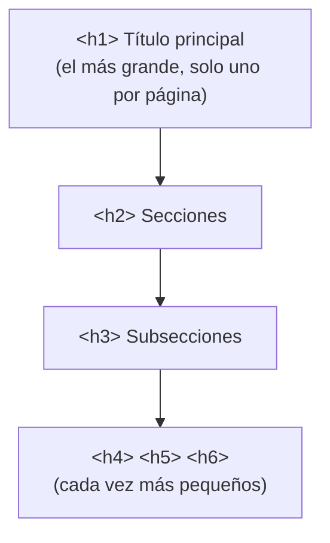
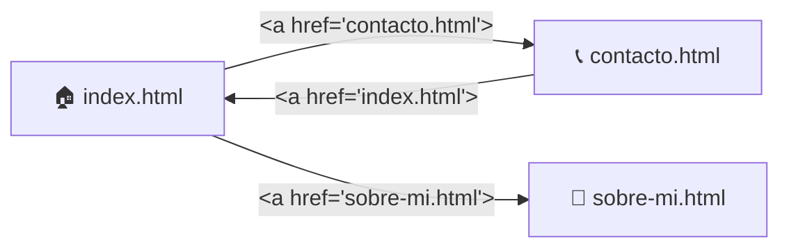
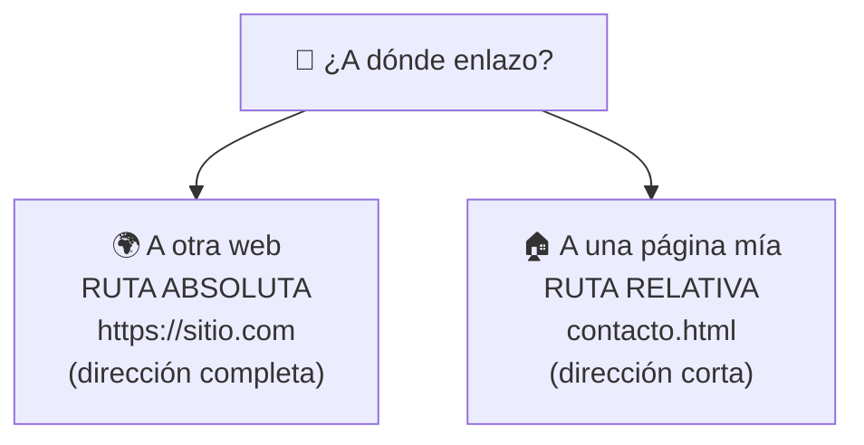
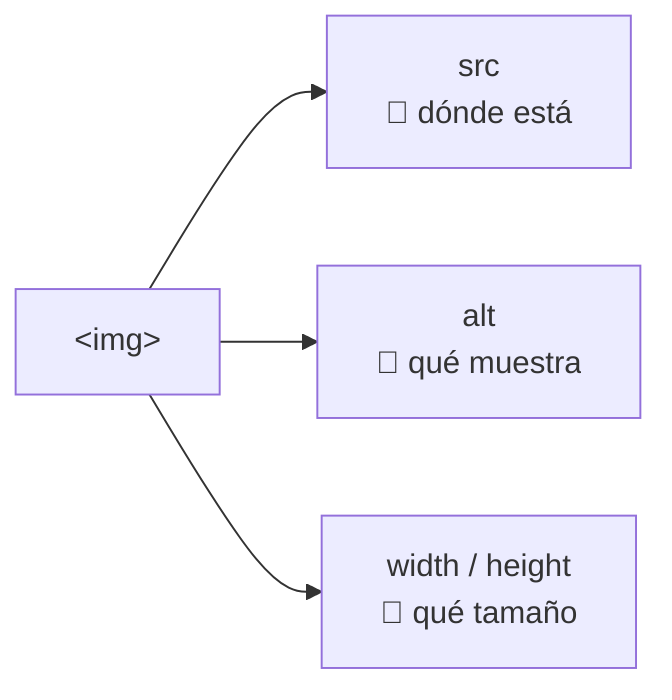
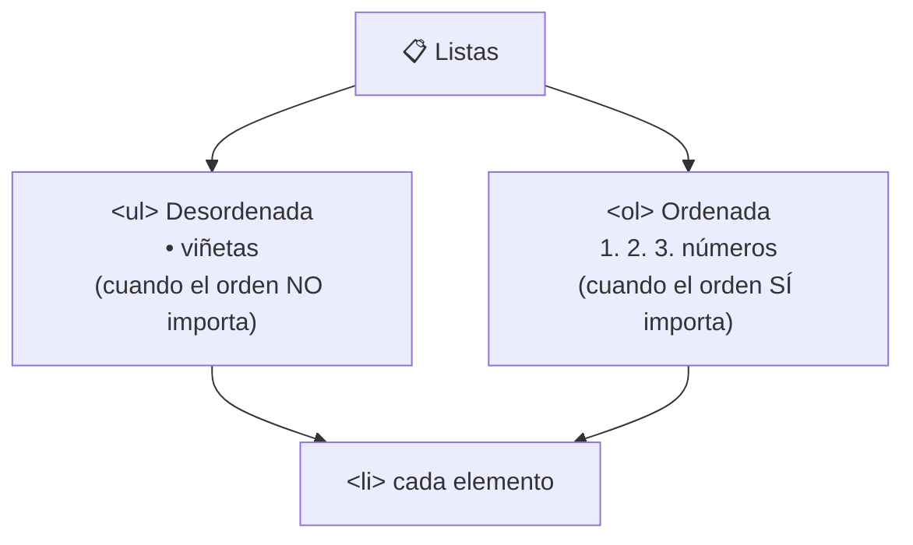
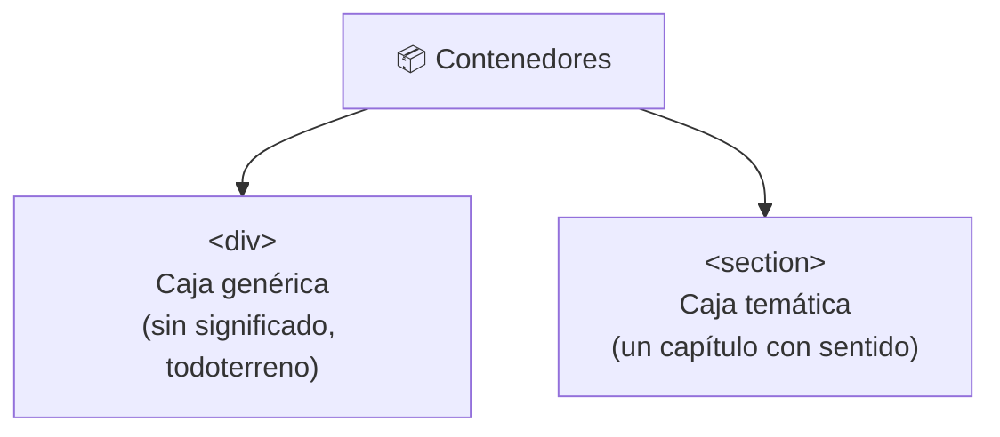
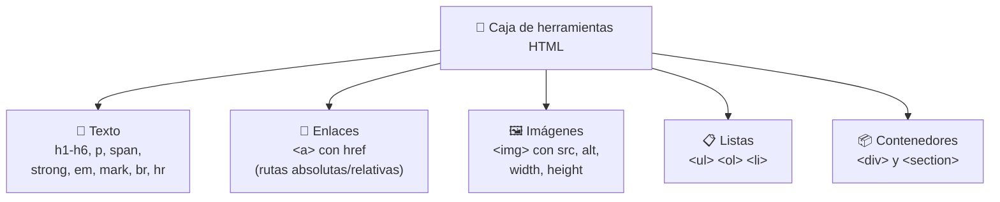

# 📓 MÓDULO 5 — Etiquetas Fundamentales de HTML

> **Objetivo del módulo:** Aprender las etiquetas esenciales que de verdad necesitas… las que usarás en el 90% de tus páginas, sin relleno.

¡Llegó el módulo más divertido hasta ahora! Hasta aquí construimos los cimientos (Módulo 4) y entendimos cómo piensa el navegador (Módulo 3). Ahora vamos a **amueblar la casa**: llenar el `<body>` con contenido real que la gente puede ver, leer y tocar.

La metáfora de este módulo: 🧰 **las etiquetas son tu caja de herramientas.** No necesitas las 150 que existen; con un buen martillo, un destornillador y unos clavos construyes casi todo. Aquí están tus herramientas esenciales.

> 🧠 **Recuerda la filosofía del curso:** no vas a memorizar esta lista. La vas a _usar_. Tenla a mano como un catálogo y consúltala cuando la necesites. Eso es exactamente lo que hacen los profesionales.

---

## 📝 Texto y contenido

El texto es el corazón de casi cualquier página. Estas etiquetas le dan **estructura y significado** a lo que escribes.

### `<h1>` a `<h6>` — Los títulos

Son los **títulos y subtítulos**, ordenados por importancia: `<h1>` es el más grande e importante, y `<h6>` el más pequeño. Funcionan como los **títulos de un periódico**: el titular principal es enorme, y las secciones tienen títulos cada vez más pequeños.

```html
<h1>Título principal de la página</h1>
<h2>Una sección importante</h2>
<h3>Una subsección dentro de la anterior</h3>
```



> 💡 **Regla de oro:** usa **un solo `<h1>` por página** (el tema principal) y respeta el orden jerárquico. No saltes de `<h1>` a `<h4>` solo porque "se ve más pequeño". Esto ayuda muchísimo al SEO que vimos en el Módulo 4: Google usa los títulos para entender la organización de tu contenido.

### `<p>` — Los párrafos

La etiqueta `<p>` (de _paragraph_) envuelve **bloques de texto normal**. Es la herramienta que más usarás para el contenido escrito.

```html
<p>Este es un párrafo de texto normal. Aquí va la mayoría de lo que la gente lee en tu página.</p>
```

Cada `<p>` crea su propio bloque con un espacio antes y después, separando las ideas como los párrafos de un libro.

### `<span>` — El resaltador invisible

`<span>` envuelve **un trocito de texto dentro de otro**, sin cambiar nada visualmente por sí solo. Se usa para "marcar" una parte y luego darle estilo o color con CSS más adelante.

```html
<p>El precio es <span>$50.000</span> por unidad.</p>
```

> 🖍️ **Metáfora:** `<span>` es como tomar un marcador y rodear una palabra para "tenerla ubicada", aunque todavía no la pintes. Sola no hace nada visible; su poder se activa después con CSS.

### `<strong>` y `<em>` — Énfasis con significado

Estas dos dan **importancia** al texto, y lo importante es que tienen _significado_, no solo apariencia:

```html
<p>Esto es <strong>muy importante</strong> y esto va con <em>énfasis suave</em>.</p>
```

`<strong>` muestra el texto en **negrita** e indica "esto es importante". `<em>` lo muestra en _cursiva_ e indica un énfasis o tono especial, como cuando alzas un poco la voz al hablar. La diferencia con simplemente "ponerlo en negrita" es que estas etiquetas le comunican el _significado_ a Google y a los lectores de pantalla para personas con discapacidad visual.

### `<mark>`, `<br>` y `<hr>` — Detalles útiles

Tres etiquetas pequeñas pero prácticas:

```html
<p>Texto con una parte <mark>resaltada en amarillo</mark>.</p>
<p>Primera línea<br>Segunda línea forzada</p>
<hr>
```

`<mark>` resalta texto como con un **marcador fluorescente** 🟡. `<br>` fuerza un **salto de línea** (es autocerrada, ¿la recuerdas del Módulo 2?), como pulsar Enter. Y `<hr>` dibuja una **línea horizontal** que separa secciones, como el corte entre dos temas.

|Etiqueta|Qué hace|Metáfora|
|---|---|---|
|`<strong>`|Negrita con importancia|Subrayar lo crucial|
|`<em>`|Cursiva con énfasis|Alzar la voz al hablar|
|`<mark>`|Resalta en amarillo|Marcador fluorescente|
|`<br>`|Salto de línea|Pulsar Enter|
|`<hr>`|Línea separadora|Raya entre dos temas|

---

## 🔗 Enlaces

Los enlaces son **lo que hace que la web sea "web"**: hilos que conectan unas páginas con otras. Sin ellos, cada página sería una isla aislada.

### `<a>` — La etiqueta del enlace

`<a>` (de _anchor_, ancla) crea un enlace en el que se puede hacer clic. Su atributo clave es `href`, que indica **a dónde lleva**.

```html
<a href="https://google.com">Ir a Google</a>
```

> 🚪 **Metáfora:** un enlace es una **puerta**. El texto entre las etiquetas es el letrero de la puerta ("Ir a Google"), y el `href` es la habitación a la que te lleva al cruzarla.

### Navegación entre páginas

Cuando tu sitio tiene varias páginas (inicio, contacto, sobre mí…), los enlaces son los que permiten **moverse entre ellas**:

```html
<a href="contacto.html">Ir a la página de contacto</a>
```



Así se construye un menú de navegación: cada opción es un `<a>` que apunta a una página distinta de tu sitio.

### Rutas absolutas y relativas

Aquí hay un concepto que confunde al inicio, pero la metáfora lo resuelve. Hay **dos formas** de decirle a un enlace a dónde ir:

Una **ruta absoluta** es la **dirección completa**, con todo el `https://...`. Sirve para enlazar a sitios _externos_ (otras webs). Es como dar tu dirección postal completa: país, ciudad, calle y número.

Una **ruta relativa** es una **dirección corta** dentro de tu propio sitio, asumiendo que ya estás "en casa". Sirve para enlazar entre _tus propias_ páginas. Es como decir "está en la habitación de al lado": no hace falta repetir la dirección completa porque ya estás dentro.

```html
<!-- Ruta ABSOLUTA: a otro sitio web -->
<a href="https://wikipedia.org">Ir a Wikipedia</a>

<!-- Ruta RELATIVA: a una página de mi propio sitio -->
<a href="contacto.html">Ir a mi contacto</a>
```



---

## 🖼 Imágenes

Una imagen vale más que mil palabras, y en HTML se coloca con una sola etiqueta autocerrada: ``.

### `` y sus atributos

A diferencia de otras etiquetas, `` **no envuelve nada** (es autocerrada) y depende totalmente de sus atributos para funcionar:

```html

```

Veamos cada atributo:

|Atributo|Qué hace|¿Obligatorio?|
|---|---|---|
|`src`|**Dónde está** la imagen (su ruta o URL)|✅ Sí, sin esto no hay imagen|
|`alt`|**Texto descriptivo** si la imagen no carga|✅ Muy recomendado|
|`width`|**Ancho** en píxeles|Opcional|
|`height`|**Alto** en píxeles|Opcional|



### `src` — La fuente

Es el atributo **obligatorio**: le dice al navegador **dónde encontrar** la imagen, igual que el `href` de un enlace. Puede ser un archivo tuyo (`fotos/perro.jpg`) o una dirección de Internet. Sin `src`, no se muestra nada.

### `alt` — El texto alternativo

Es un **texto que describe la imagen** y aparece si la imagen no carga. Pero su rol más importante es la **accesibilidad**: las personas ciegas usan lectores de pantalla que leen ese `alt` en voz alta. También ayuda al SEO, porque Google "lee" las imágenes a través de él.

> ♿ **Por qué importa el `alt`:** imagina describirle una foto por teléfono a alguien que no puede verla. Eso es el `alt`. Escribir buenos `alt` no es opcional para un buen desarrollador; es parte de hacer la web para _todos_.

### `width` y `height` — El tamaño

Controlan el **ancho y alto** de la imagen en píxeles. Son opcionales (la imagen tiene su tamaño natural), pero declararlos ayuda a que la página no "salte" mientras carga. Es como reservar el espacio del cuadro en la pared antes de colgarlo.

---

## 📋 Listas

Las listas organizan elementos en grupos ordenados o desordenados. Las ves por todas partes: menús, pasos de una receta, listas de compras.

### `<ul>`, `<ol>` y `<li>`

Hay dos tipos de listas, y ambas usan `<li>` (de _list item_) para cada elemento:

```html
<!-- Lista DESORDENADA (con viñetas •) -->
<ul>
  <li>Manzanas</li>
  <li>Pan</li>
  <li>Leche</li>
</ul>

<!-- Lista ORDENADA (con números 1, 2, 3) -->
<ol>
  <li>Precalentar el horno</li>
  <li>Mezclar los ingredientes</li>
  <li>Hornear 30 minutos</li>
</ol>
```



La regla para elegir es simple: si el **orden importa** (los pasos de una receta), usa `<ol>` (ordenada, con números). Si **no importa** (una lista de compras), usa `<ul>` (desordenada, con viñetas). En ambos casos, **cada elemento va dentro de un `<li>`**.

> 🛒 **Metáfora:** `<ul>` es tu lista del súper (da igual el orden en que compres). `<ol>` es una receta (si horneas antes de mezclar, sale mal). El `<li>` es cada renglón de la lista.

---

## 📦 Contenedores

Los contenedores no se ven por sí mismos, pero son **fundamentales para organizar** tu página. Son como las **cajas** donde agrupas cosas relacionadas.

### `<div>` — La caja todoterreno

`<div>` es una **caja genérica** que agrupa otros elementos. No tiene un significado especial; solo sirve para juntar cosas y luego darles estilo o posición con CSS.

```html
<div>
  <h2>Tarjeta de producto</h2>
  <p>Descripción del producto</p>
  
</div>
```

> 📦 **Metáfora:** un `<div>` es una **caja de cartón sin etiqueta**. Sirve para meter cosas dentro y moverlas juntas, pero no dice qué contiene. Es la herramienta más usada para agrupar y maquetar.

### `<section>` — La caja con significado

`<section>` hace algo parecido a `<div>` (agrupa contenido), pero con una diferencia clave: **tiene significado**. Indica que ahí dentro hay una **sección temática** de la página, como un capítulo.

```html
<section>
  <h2>Sobre nosotros</h2>
  <p>Somos una empresa dedicada a...</p>
</section>
```



> 💡 **¿Cuándo uso cada uno?** Usa `<section>` cuando el grupo de contenido es una **parte lógica** de la página (la sección de "contacto", la de "servicios"). Usa `<div>` cuando solo necesitas **agrupar para dar estilo** sin que represente un tema concreto. Si dudas, no te estreses: ambos funcionan; con la práctica le tomarás el gusto.

---

## 🔬 Mini–proyecto sugerido

La mejor forma de fijar todo esto es **usarlo**. Intenta crear una pequeña página "Sobre mí" combinando lo aprendido:

- Un `<h1>` con tu nombre.
- Un `<p>` presentándote, con alguna palabra en `<strong>`.
- Una `` con tu foto (¡y su `alt`!).
- Una `<ul>` con tus 3 hobbies favoritos.
- Un `<a>` enlazando a tu red social favorita.
- Todo agrupado dentro de una `<section>`.

No tiene que verse bonito todavía (eso es CSS, vendrá después). El objetivo es que **practiques las herramientas**. Equivócate, prueba, recarga y vuelve a intentar. Así se aprende de verdad.

---

## 📝 Resumen del Módulo 5



En resumen, hoy llenaste tu caja de herramientas con las etiquetas esenciales: para **texto**, los títulos `<h1>` a `<h6>` (uno solo `<h1>` por página), párrafos `<p>`, y marcadores como `<strong>`, `<em>` y `<mark>` que dan _significado_, no solo apariencia. Para **conectar páginas**, el enlace `<a>` con su `href`, distinguiendo rutas absolutas (a otras webs) de relativas (a tus propias páginas). Para **imágenes**, la etiqueta `` con su `src` obligatorio y el `alt` que hace la web accesible para todos. Para **organizar**, las listas `<ul>`/`<ol>`/`<li>` y los contenedores `<div>` (caja genérica) y `<section>` (caja con significado).

> 🚀 **Siguiente paso:** Ya tienes las herramientas para crear contenido real. Tu casa tiene estructura _y_ muebles. En los próximos módulos aprenderás a **decorarla con CSS**: colores, tipografías, espacios y diseños modernos. ¡El lado visual está por comenzar!