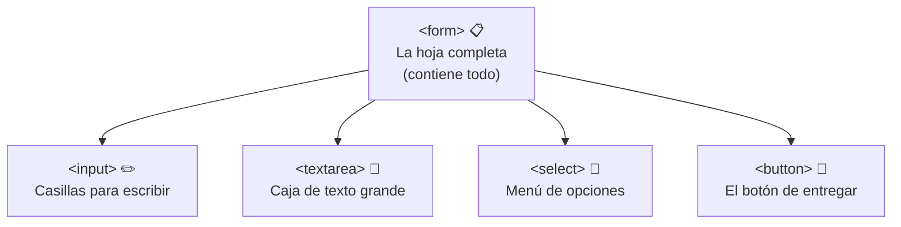
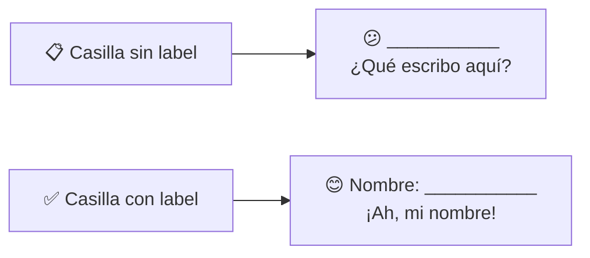
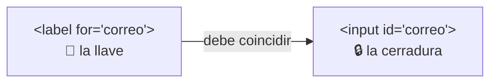
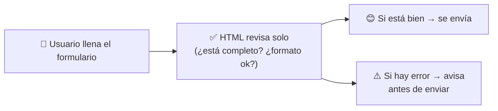
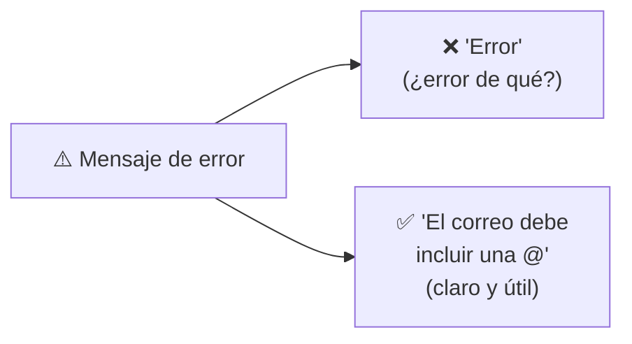
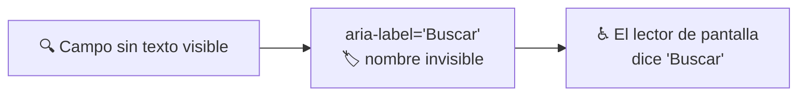
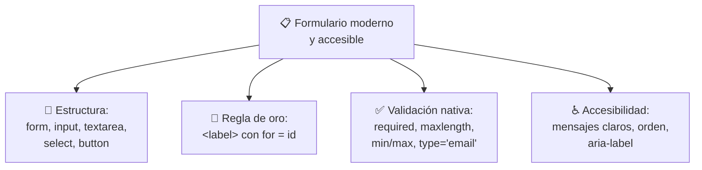

# 📝 MÓDULO 9 — Formularios Modernos y Accesibles

> **Objetivo del módulo:** Crear formularios profesionales y fáciles de usar… esos que la gente completa sin frustrarse y que funcionan para todos.

Los formularios están **por todas partes**: el login de tu correo, el buscador de Google, el carrito de una tienda, el formulario de contacto de cualquier empresa. Son el puente por donde el usuario _le habla_ a tu página. Hoy aprenderás a construirlos bien, porque un formulario mal hecho es la forma más rápida de perder a un visitante.

La metáfora de este módulo: 📋 **un formulario web es como un formulario de papel.** Tiene su hoja completa, sus casillas para escribir, sus etiquetas que dicen qué va en cada casilla, sus opciones para marcar, y un botón final para "entregarlo". Si entiendes una solicitud de papel, entiendes los formularios web.

---

## 📝 Estructura de formularios

Todo formulario se arma con un puñado de piezas que cumplen funciones distintas. Veámoslas como las partes de una ficha de inscripción.



### `<form>` — La hoja completa

`<form>` es el **contenedor que envuelve todo el formulario**. Es la hoja de papel donde van todas las casillas. Todo lo demás (campos, botones) vive dentro de ella.

```html
<form>
  <!-- aquí van todos los campos -->
</form>
```

### `<input>` — Las casillas

`<input>` es la pieza más versátil: una **casilla donde el usuario escribe o selecciona algo**. Su superpoder está en el atributo `type`, que cambia _qué tipo_ de casilla es:

```html
<input type="text" placeholder="Tu nombre">
<input type="email" placeholder="Tu correo">
<input type="password" placeholder="Tu contraseña">
<input type="checkbox"> Acepto los términos
```

> ✏️ **Metáfora:** `<input>` es como las casillas de un formulario de papel, pero **camaleónicas**: con `type="text"` es una línea para escribir, con `type="checkbox"` es una casilla para marcar con una X, con `type="date"` es donde pones una fecha. La misma etiqueta cambia de forma según lo que necesites.

|`type=`|Para qué sirve|
|---|---|
|`text`|Texto corto (nombre, ciudad)|
|`email`|Correos (¡valida el formato solo!)|
|`password`|Contraseñas (oculta los caracteres)|
|`number`|Solo números|
|`date`|Fechas|
|`checkbox`|Casillas de marcar|

### `<textarea>` — La caja de texto grande

Cuando necesitas que el usuario escriba **mucho texto** (un mensaje, un comentario), usas `<textarea>`. Es una caja amplia y redimensionable, a diferencia del `<input type="text">` que es una sola línea.

```html
<textarea placeholder="Escribe tu mensaje aquí..."></textarea>
```

### `<select>` — El menú de opciones

`<select>` crea un **menú desplegable** para elegir entre opciones predefinidas. Cada opción va en un `<option>`:

```html
<select>
  <option>Colombia</option>
  <option>México</option>
  <option>Argentina</option>
</select>
```

> 🔽 **Metáfora:** `<select>` es como esas preguntas de papel donde tienes que **marcar una sola opción de una lista cerrada**. En vez de escribir tu país, lo eliges de un menú. Evita errores y agiliza el llenado.

### `<button>` — El botón de entregar

`<button>` es el botón que **envía el formulario** (o ejecuta una acción). Es el "entregar la hoja" del trámite.

```html
<button>Enviar</button>
```

---

## 🏷 La regla de oro del `<label>`

Aquí está **el concepto más importante** de todo el módulo, y el que más se ignora: cada casilla necesita una **etiqueta `<label>`** que diga qué va en ella. Sin etiqueta, una casilla es como una línea en blanco sin nada que indique qué escribir.



### Relación entre `for` e `id`

La magia está en **conectar** la etiqueta con su casilla. Esto se hace con dos atributos que deben coincidir: el `for` del `<label>` y el `id` del `<input>`. **El `for` apunta al `id`**, como una llave que encaja en su cerradura.

```html
<label for="correo">Tu correo electrónico:</label>
<input type="email" id="correo">
```



> 🔑 **Metáfora:** el `for` y el `id` son una **llave y su cerradura** que comparten el mismo código secreto (`"correo"`). Cuando coinciden, quedan unidos: al tocar la etiqueta, se activa la casilla.

¿Por qué importa tanto esta conexión? Por dos razones potentes:

1. **Comodidad:** al hacer clic en la etiqueta "Tu correo", el cursor salta solo a la casilla. Más fácil de usar, sobre todo en celulares.
2. **Accesibilidad:** los lectores de pantalla **leen la etiqueta en voz alta** cuando el usuario llega a la casilla. Sin `<label>`, una persona ciega oye "campo de texto" sin saber qué escribir. Con él, oye "Tu correo electrónico, campo de texto". La diferencia es enorme.

> 💡 **La regla de oro:** **toda casilla lleva su `<label>` conectado.** No es opcional ni decorativo; es lo que hace tu formulario usable para todos. Si solo recuerdas una cosa de este módulo, que sea esta.

---

## ✅ Validación nativa

"Validar" significa **comprobar que lo que el usuario escribió es correcto** antes de enviarlo (que el correo tenga formato de correo, que no deje campos obligatorios vacíos, etc.). Lo mejor es que HTML hace mucho de esto **solo**, sin necesidad de programación. Por eso se llama validación "nativa".



Estos son los atributos de validación más útiles:

### `required` — Campo obligatorio

Marca un campo como **obligatorio**: el formulario no se enviará si está vacío. El navegador avisa solo.

```html
<input type="text" required>
```

### `maxlength` — Límite de caracteres

Limita **cuántos caracteres** se pueden escribir. Útil para evitar textos demasiado largos.

```html
<input type="text" maxlength="50">
```

### `min` y `max` — Rango de valores

Para campos numéricos o de fecha, definen el **valor mínimo y máximo** permitido.

```html
<input type="number" min="18" max="99">
```

### `type="email"` — Validación de formato

Como vimos, ciertos `type` validan el **formato** automáticamente. `type="email"` exige que el texto parezca un correo (que tenga `@`, por ejemplo) antes de aceptar el envío.

```html
<input type="email" required>
```

|Atributo|Qué comprueba|Ejemplo de uso|
|---|---|---|
|`required`|Que no esté vacío|Campos obligatorios|
|`maxlength`|Que no exceda X caracteres|Un usuario, un título|
|`min` / `max`|Que esté en un rango|Edad, cantidad, fecha|
|`type="email"`|Que tenga formato de correo|Campo de email|

> 🛡️ **Metáfora:** la validación nativa es como un **portero amable en la entrada**. Antes de dejar pasar el formulario, revisa: "¿Llenaste todo lo obligatorio? ¿Ese correo es de verdad un correo?". Si algo falla, te lo dice con educación para que lo arregles, y todo sin que tú tengas que programar nada.

---

## ♿ Accesibilidad en formularios

Un formulario accesible es uno que **cualquier persona puede completar**, use mouse, teclado o lector de pantalla. Retomamos lo aprendido sobre accesibilidad (el `<label>` de hoy, el teclado del Módulo 8) y lo redondeamos.

### Mensajes claros

Cuando algo sale mal, el usuario necesita **entender qué corregir**. Un mensaje útil dice exactamente el problema y cómo resolverlo.



Compara: un "Error" seco frustra; un "Falta tu nombre" o "La contraseña necesita al menos 8 caracteres" guía. Sé específico y amable, como le explicarías a un amigo qué le faltó.

### Navegación correcta

Recuerda el Módulo 8: el usuario debe poder recorrer el formulario **con TAB en orden lógico**, de arriba abajo, campo por campo. Como esto sigue el orden de tu HTML, basta con **escribir los campos en el orden natural** en que se llenan. Un formulario bien ordenado se navega solo, con o sin mouse.

### Uso básico de `aria-label`

A veces tienes un campo **sin etiqueta visible** (un buscador con solo una lupa, por ejemplo). En esos casos, `aria-label` le da un **nombre invisible** que los lectores de pantalla sí leen, aunque no aparezca en pantalla.

```html
<input type="search" aria-label="Buscar en el sitio">
```



> 🏷️ **Metáfora:** `aria-label` es como una **etiqueta en braille** pegada por detrás de un objeto: tú no la ves, pero quien la necesita la "lee" perfectamente. Da nombre a lo que visualmente no lo tiene.

> 💡 **Importante:** `aria-label` **no reemplaza** al `<label>`. Siempre que puedas, usa un `<label>` visible (beneficia a _todos_). Reserva `aria-label` para los casos donde de verdad no hay texto visible que mostrar.

---

## 🔬 Mini–proyecto sugerido

Pon a prueba todo construyendo un **formulario de contacto** sencillo:

- Un `<form>` que lo envuelva todo.
- Un campo de **nombre** (`<input type="text">`) con su `<label>` y `required`.
- Un campo de **correo** (`<input type="email">`) con su `<label>` y `required`.
- Un **mensaje** (`<textarea>`) con su `<label>`.
- Un `<select>` para elegir el **motivo** de contacto.
- Un `<button>` para **enviar**.

Recuerda conectar cada `<label>` con su campo usando `for` e `id`. Ábrelo en el navegador, intenta enviarlo vacío y observa cómo el "portero" (la validación nativa) te detiene. ¡Acabas de crear un formulario profesional y accesible!

---

## 📝 Resumen del Módulo 9



En resumen, hoy aprendiste a construir formularios como un profesional: la **estructura** se arma con `<form>` (la hoja), `<input>` (las casillas camaleónicas según su `type`), `<textarea>` (texto largo), `<select>` (menú de opciones) y `<button>` (entregar). Interiorizaste la **regla de oro del `<label>`**: cada casilla lleva su etiqueta conectada con `for` e `id` (llave y cerradura), por comodidad y, sobre todo, por accesibilidad. Descubriste la **validación nativa** que HTML hace solo (`required`, `maxlength`, `min`/`max`, `type="email"`), ese portero amable que revisa antes de enviar. Y cerraste con **accesibilidad**: mensajes de error claros, navegación ordenada por teclado y `aria-label` para dar nombre a campos sin texto visible.

> 🚀 **Siguiente paso:** Ya sabes recibir información de tus usuarios con formularios sólidos y accesibles. Has completado las piezas interactivas del HTML. A partir de aquí, el siguiente gran salto es el **diseño visual con CSS**: convertir todas estas estructuras correctas en páginas que además se vean modernas y hermosas. ¡La parte más creativa te espera!