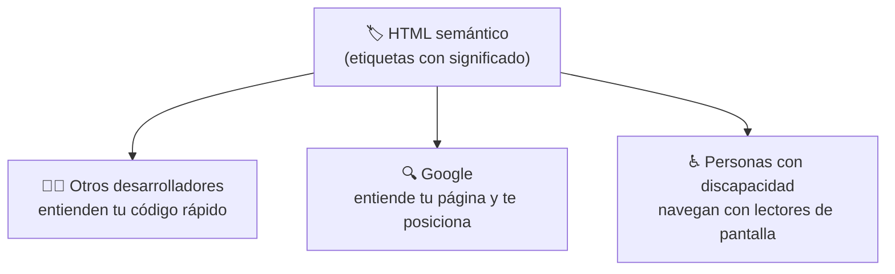
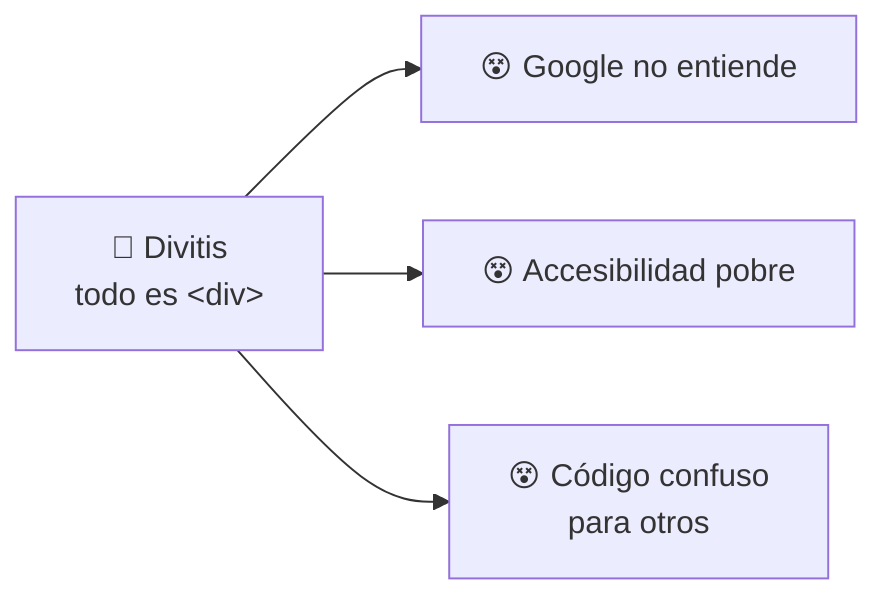
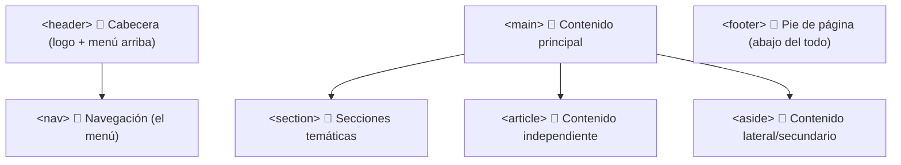
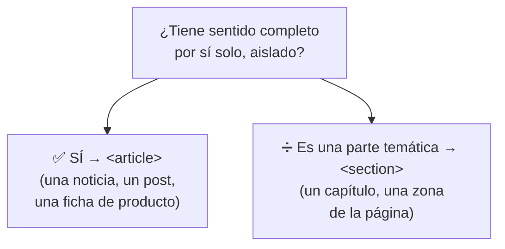
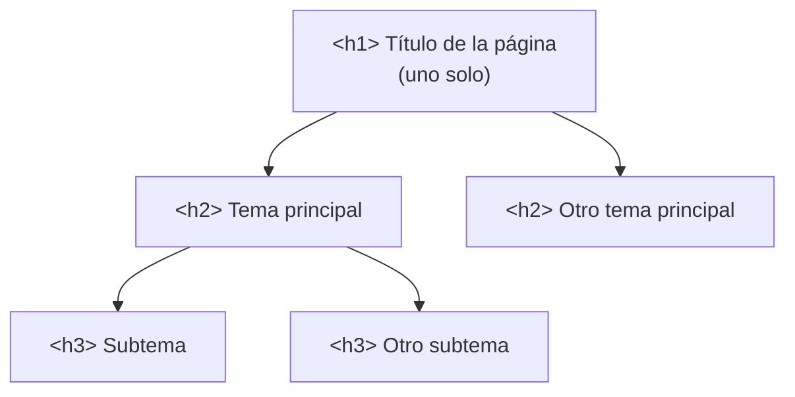
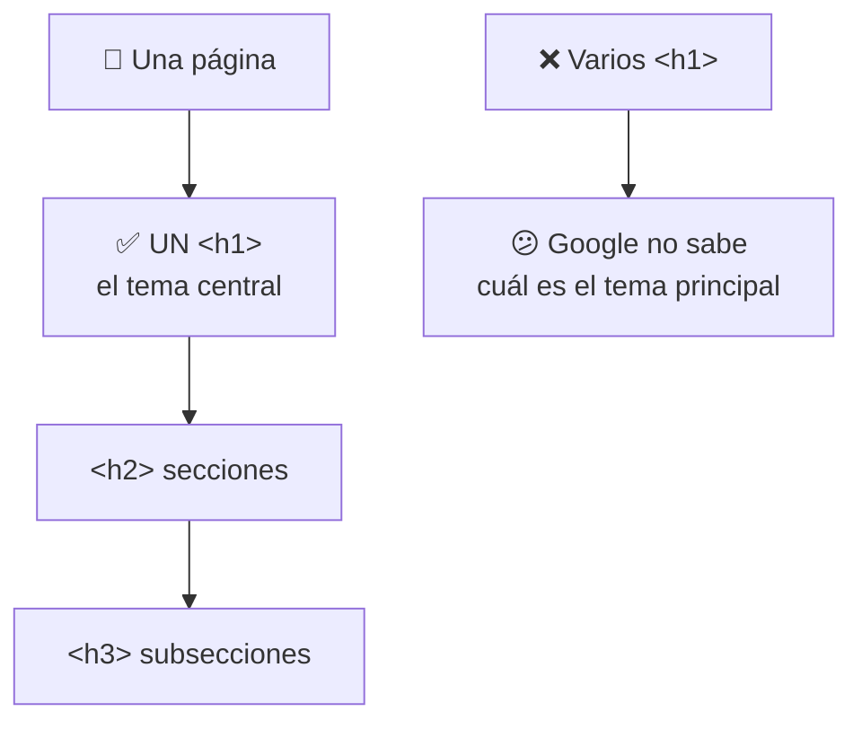
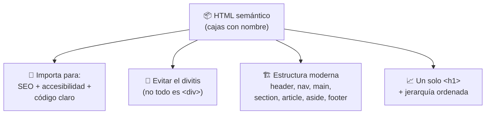

# 📔 MÓDULO 6 — HTML Semántico Profesional

> **Objetivo del módulo:** Aprender a estructurar páginas como un desarrollador profesional… dándole _nombre y sentido_ a cada parte de tu web.

En el Módulo 5 aprendiste a usar cajas para agrupar contenido (`<div>` y `<section>`). Hoy damos el salto de "principiante que junta cosas" a "profesional que organiza con intención". El secreto tiene un nombre: **semántica**. Suena técnico, pero la idea es de lo más natural.

La metáfora de este módulo: 📦 **una web bien hecha es como una mudanza con cajas etiquetadas.** Imagina dos mudanzas: en una, todas las cajas dicen "cosas". En la otra, cada caja dice "cocina", "libros", "ropa". ¿Cuál vas a desempacar sin volverte loco? La segunda. Eso es exactamente lo que hace el HTML semántico.

---

## 🧠 Qué es la semántica

**Semántica** significa simplemente **usar la etiqueta correcta según el significado de cada cosa**. En lugar de meter todo en cajas genéricas (`<div>`), usas etiquetas que _dicen qué son_: un encabezado se marca como encabezado, un menú como menú, el contenido principal como principal.

```html
<!-- ❌ Sin semántica: cajas anónimas -->
<div>
  <div>Menú del sitio</div>
  <div>Contenido principal</div>
</div>

<!-- ✅ Con semántica: cajas con nombre -->
<header>
  <nav>Menú del sitio</nav>
</header>
<main>Contenido principal</main>
```

Ambos ejemplos se ven **idénticos** en pantalla. La diferencia está en que el segundo _tiene significado_: cualquiera (un humano, Google o un programa) entiende qué es cada parte con solo leer las etiquetas.

### Por qué importa

Porque el significado lo leen **tres públicos distintos**, y a los tres les ayudas escribiendo bien:



### Cómo ayuda al SEO

Recuerda del Módulo 4 que Google envía robots a "leer" tu página. Cuando usas etiquetas semánticas, le estás dando **un mapa claro**: "esto es el menú, esto es el contenido principal, esto es información secundaria". Google entiende mejor de qué trata tu sitio y **te muestra a las personas correctas**. Una web semántica posiciona mejor que un montón de `<div>` anónimos.

### Cómo ayuda a la accesibilidad

Las personas ciegas o con baja visión navegan con **lectores de pantalla**: programas que leen la página en voz alta. Estos programas usan las etiquetas semánticas para decir "estás en el menú de navegación" o "este es el contenido principal", y permiten saltar directo a lo que importa.

> ♿ **Metáfora:** sin semántica, un lector de pantalla es como entrar a un edificio **sin letreros**: no sabes dónde está la salida, el baño ni las escaleras. Con semántica, cada puerta tiene su letrero. Escribir HTML semántico es construir una web para _todos_, no solo para quienes pueden verla.

---

## 🚫 El peligro del "Divitis"

El **"divitis"** es una "enfermedad" muy común en principiantes (¡y en algunos no tan principiantes!): **usar `<div>` para absolutamente todo**. Como el `<div>` funciona para cualquier cosa, es tentador no salir de él.

```html
<!-- 🤒 Síntoma de divitis -->
<div class="header">
  <div class="nav">
    <div class="menu-item">Inicio</div>
    <div class="menu-item">Contacto</div>
  </div>
</div>
<div class="main">
  <div class="article">...</div>
</div>
```

¿El problema? Visualmente funciona, pero el código es una **mudanza de cajas que solo dicen "cosas"**. Nadie —ni Google, ni otro programador, ni un lector de pantalla— sabe qué es cada parte. Has perdido todas las ventajas de la semántica.



> 💊 **La cura:** antes de escribir un `<div>`, pregúntate _"¿existe una etiqueta que describa mejor esto?"_. Si es un menú, usa `<nav>`. Si es el pie de página, usa `<footer>`. El `<div>` sigue siendo útil, pero solo cuando **ninguna otra etiqueta encaja**. Es el último recurso, no el primero.

---

## 🏗 Estructura moderna de una web

Aquí están las etiquetas semánticas que reemplazan a los `<div>` anónimos. Lo bonito es que casi toda página del mundo sigue **este mismo plano**, como las habitaciones estándar de una casa.



Veamos cada "habitación" con su función:

|Etiqueta|Qué es|Metáfora|
|---|---|---|
|`<header>`|La parte de arriba (logo, título, menú)|El **sombrero** de la página 🎩|
|`<nav>`|El menú de navegación|El **mapa o brújula** 🧭|
|`<main>`|El contenido principal (lo más importante)|El **escenario central** 🎯|
|`<section>`|Una sección temática del contenido|Un **capítulo** de un libro 📑|
|`<article>`|Un contenido que tiene sentido por sí solo|Una **noticia recortable** 📰|
|`<aside>`|Contenido secundario o lateral|Una **nota al margen** 📌|
|`<footer>`|La parte de abajo (créditos, contacto)|Los **zapatos** de la página 👟|

Así se ve una página completa bien estructurada:

```html
<body>
  <header>
    <h1>Mi Blog de Cocina</h1>
    <nav>
      <a href="index.html">Inicio</a>
      <a href="recetas.html">Recetas</a>
    </nav>
  </header>

  <main>
    <article>
      <h2>Receta de pan casero</h2>
      <p>Hoy aprenderemos a hacer pan...</p>
    </article>

    <aside>
      <h3>Recetas relacionadas</h3>
      <p>Quizá te interese...</p>
    </aside>
  </main>

  <footer>
    <p>© 2026 Mi Blog de Cocina</p>
  </footer>
</body>
```

> 🏠 **Fíjate en lo claro que es:** sin ver la página, ya sabes que arriba hay una cabecera con menú, en el centro una receta con contenido relacionado al lado, y abajo los créditos. Eso es la semántica trabajando para ti.

---

## 📰 Organización correcta del contenido

Dos de estas etiquetas confunden mucho al principio: `<section>` y `<article>`. Vamos a resolverlo de una vez.

### Diferencia entre `<section>` y `<article>`

La pregunta mágica para distinguirlas es: **"¿esto tiene sentido completo por sí solo, fuera de la página?"**

Un `<article>` es **independiente**: tiene sentido aunque lo saques de la página y lo pongas en otro lado. Una noticia, una entrada de blog, un comentario, una ficha de producto. Si lo puedes "recortar y compartir solo", es un `<article>`.

Una `<section>` es una **parte temática** que agrupa contenido relacionado, pero que normalmente _pertenece_ a un todo mayor. El capítulo de un libro: tiene sentido, pero forma parte del libro.



> 📰 **Metáfora definitiva:** un `<article>` es una **noticia que puedes recortar del periódico** y pegar en la nevera; sigue teniendo sentido sola. Una `<section>` es la **sección "Deportes"** del periódico: agrupa noticias relacionadas, pero es parte del diario completo. De hecho, una `<section>` puede contener varios `<article>` dentro.

### Jerarquía correcta de encabezados

Recuerda los títulos `<h1>` a `<h6>` del Módulo 5. La regla es usarlos **en orden, como un índice de libro**, sin saltarte niveles:



La clave es **no saltar niveles por estética**. Si quieres un título más pequeño, no pases de `<h2>` a `<h5>`; usa el nivel que corresponde y luego ajustas el tamaño con CSS. La jerarquía describe la _importancia_ del contenido, no su tamaño visual.

---

## 📈 SEO y encabezados

Cerramos uniendo dos hilos que ya conoces: el SEO (Módulo 4) y los encabezados (Módulo 5). La forma en que organizas tus títulos **afecta directamente cómo te entiende Google**.

### Por qué solo debe existir un `<h1>` principal

El `<h1>` es el **título principal de la página**: le dice a Google y al usuario _"de esto trata todo lo demás"_. Por eso debe haber **uno solo** por página. Tener varios `<h1>` es como un libro con **tres títulos en la portada**: confunde sobre cuál es el tema real.



### Cómo estructurar el contenido correctamente

Juntando todo el módulo, una página profesional sigue esta lógica: **un `<h1>` único** que resume el tema, **etiquetas semánticas** que organizan las zonas (`header`, `nav`, `main`, `footer`...), y una **jerarquía de encabezados ordenada** que actúa como índice. Con eso, Google entiende tu página, los lectores de pantalla la navegan y otros desarrolladores la comprenden al instante.

> 💡 **Truco profesional:** imagina que alguien lee **solo tus encabezados**, sin el resto del texto. ¿Entendería de qué trata tu página y cómo está organizada? Si la respuesta es sí, tu estructura está bien hecha. Ese es el examen que pasan las páginas profesionales.

---

## 🔬 Compruébalo tú mismo

Abre un periódico digital o un blog conocido, haz **clic derecho → Inspeccionar** y busca etiquetas como `<header>`, `<nav>`, `<main>`, `<article>` y `<footer>`. Verás que los sitios profesionales **no usan `<div>` para todo**: usan estas etiquetas semánticas exactamente como las aprendiste hoy. Estás viendo la diferencia entre código amateur y código profesional, en vivo.

---

## 📝 Resumen del Módulo 6



En resumen, hoy diste el salto a profesional: la **semántica** es usar la etiqueta correcta según el significado de cada parte, y le sirve a tres públicos —otros desarrolladores, Google (mejor **SEO**) y las personas con discapacidad (mejor **accesibilidad**)—. Aprendiste a evitar el **"divitis"** (usar `<div>` para todo) reemplazándolo por etiquetas con nombre: `<header>`, `<nav>`, `<main>`, `<section>`, `<article>`, `<aside>` y `<footer>`. Resolviste la duda clásica entre `<section>` (parte temática, un capítulo) y `<article>` (contenido independiente que tiene sentido solo). Y reforzaste que debe existir **un solo `<h1>`** por página y una **jerarquía de encabezados ordenada**, como el índice de un libro, para que Google y la gente entiendan tu contenido.

> 🚀 **Siguiente paso:** Tu HTML ya está estructurado como el de un profesional: con sentido, accesible y bien organizado. Has terminado de construir y amueblar la casa _con criterio_. Lo que viene ahora es darle vida visual: colores, tipografías y diseños modernos con **CSS**. ¡El HTML quedó sólido como una roca!