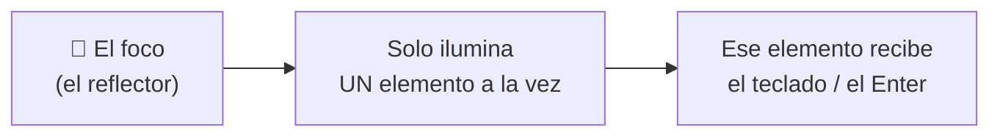
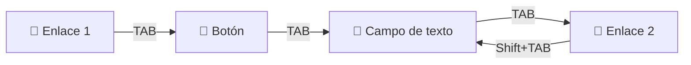
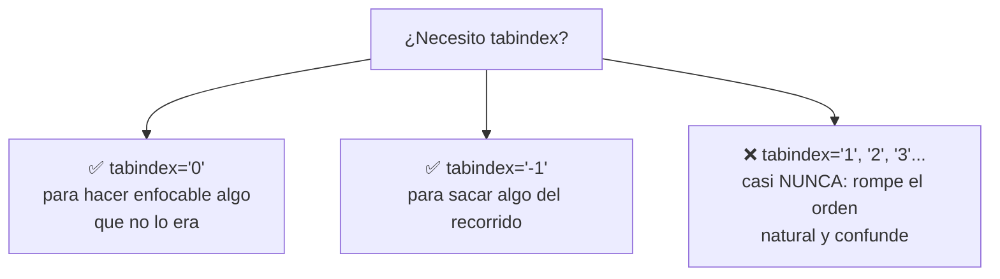
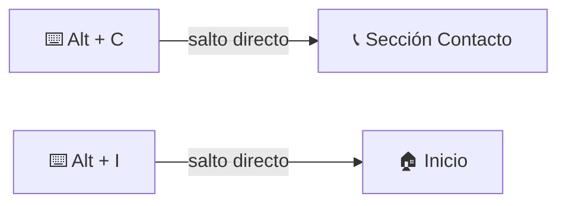
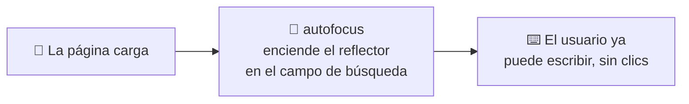
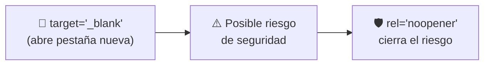
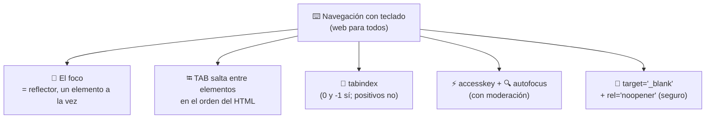

# ⌨️ MÓDULO 8 — Interacción y Navegación con Teclado

> **Objetivo del módulo:** Construir páginas utilizables para _todas_ las personas… incluyendo a quienes navegan sin mouse, solo con el teclado.

¿Sabías que mucha gente **no usa el mouse** para navegar la web? Personas con discapacidad motriz, usuarios de lectores de pantalla, o simplemente quien prefiere la rapidez del teclado. En módulos anteriores hablamos de accesibilidad (el `alt`, las etiquetas semánticas); hoy la llevamos al siguiente nivel: **que tu página se pueda usar entera sin tocar el mouse**.

La metáfora de este módulo: 🔦 **navegar con teclado es como mover un reflector por un escenario oscuro.** Solo una cosa está iluminada a la vez, y tú vas moviendo la luz de un actor al siguiente. Ese reflector tiene un nombre técnico: el **foco**.

---

## ⌨️ Navegación con teclado

Cuando alguien navega sin mouse, se mueve por la página **saltando entre elementos interactivos** (enlaces, botones, campos de formulario) usando el teclado. Entender cómo funciona esto es entender cómo experimenta tu web una parte real de tus visitantes.

### Qué es el foco

El **foco** (_focus_) es **el elemento que está "seleccionado" en este momento** y que recibirá lo que escribas o el Enter que pulses. Solo **un** elemento puede tener el foco a la vez.



Lo reconoces porque el navegador suele dibujar un **borde o resplandor** alrededor del elemento enfocado (ese contorno azul que a veces ves en botones y campos). Ese contorno **no es un error ni algo feo que haya que quitar**: es la luz del reflector indicando dónde estás. Quitarlo sin reemplazarlo deja "a oscuras" a quien navega con teclado.

> 🔦 **Metáfora:** el foco es el reflector del teatro. En un escenario a oscuras, solo ves al actor iluminado. Si apagas el reflector (quitas el contorno), el público teclado-dependiente ya no sabe dónde está parado.

### Cómo funciona la tecla TAB

La tecla **TAB** es la herramienta principal para moverse: cada vez que la pulsas, el foco **salta al siguiente elemento interactivo**. Con **Shift + TAB**, retrocedes al anterior.



Pruébalo ahora mismo en cualquier página: pulsa TAB varias veces y observa cómo el reflector va saltando de un enlace o botón al siguiente. Acabas de navegar como lo hacen millones de personas.

### Orden correcto de navegación

Aquí está la clave: por defecto, el foco salta **en el mismo orden en que escribiste los elementos en tu HTML**, de arriba hacia abajo. Por eso un HTML **bien ordenado** (como aprendiste en los módulos de estructura) ya te da una navegación con teclado lógica y gratuita.

> 💡 **Buena noticia:** si escribiste tu HTML de forma ordenada y semántica, ¡ya tienes una navegación por teclado decente sin esfuerzo extra! El orden de tu código _es_ el orden del recorrido. Esta es otra razón para escribir HTML limpio.

---

## 🎯 `tabindex`

A veces necesitas **controlar ese orden** o decidir qué elementos pueden recibir el foco. Para eso existe el atributo `tabindex`. Es como tener el control manual del reflector.

### Cómo controlar la navegación

`tabindex` acepta distintos valores, y cada uno hace algo diferente:

|Valor|Qué hace|Metáfora|
|---|---|---|
|`tabindex="0"`|Hace que un elemento **entre en el orden normal** del TAB|"Súmate a la fila"|
|`tabindex="-1"`|El elemento **no se alcanza con TAB** (pero sí por programación)|"Sal de la fila, pero quédate disponible"|
|`tabindex="1"` o más|**Fuerza un orden específico** (¡peligroso!)|"Cuélate al frente de la fila"|

```html
<!-- Un elemento que normalmente no es enfocable, ahora sí -->
<div tabindex="0">Ahora puedo recibir foco con TAB</div>
```

### Buenas prácticas

La regla de oro con `tabindex` es: **úsalo lo menos posible**. Suena raro, pero es así de simple:



Los valores positivos (`1`, `2`, `3`...) son **una trampa**: parecen útiles, pero "se cuelan al frente de la fila" y desordenan toda la navegación, creando una experiencia confusa. La recomendación profesional: confía en el **orden natural de tu HTML**, y usa solo `tabindex="0"` o `tabindex="-1"` cuando de verdad lo necesites.

> 🚦 **Metáfora:** los `tabindex` positivos son como esos que se cuelan en la fila del banco. Crean caos y todos se molestan. Deja que la fila avance en orden (el orden de tu HTML) y tendrás paz.

---

## ⚡ `accesskey`

`accesskey` crea un **atajo de teclado** para saltar directamente a un elemento, sin pasar por todos los demás con TAB. Es como tener un botón de "ir directo a...".

### Atajos rápidos de teclado

Le asignas una tecla a un elemento, y el usuario puede activarlo con una combinación (que varía según el navegador, por ejemplo `Alt + la tecla`):

```html
<a href="contacto.html" accesskey="c">Contacto (Alt+C)</a>
<a href="inicio.html" accesskey="i">Inicio (Alt+I)</a>
```



> ⚡ **Metáfora:** `accesskey` es como los **marcadores de teléfono rápido**. En vez de buscar el número en la agenda (ir con TAB elemento por elemento), pulsas una tecla y llamas directo.

### Cuándo usarlo

Sé honesto: `accesskey` se usa **poco** en la práctica, y tiene sus problemas. Las combinaciones de teclas que eliges pueden **chocar** con atajos que ya usa el navegador o el sistema operativo, causando conflictos inesperados. Por eso conviene usarlo **solo para acciones muy frecuentes** (como un buscador o el menú principal) y siempre **avisando al usuario** cuál es el atajo. Si dudas, es preferible no usarlo: una navegación con TAB bien ordenada suele ser suficiente.

---

## 🔍 `autofocus`

`autofocus` hace que un elemento **reciba el foco automáticamente** apenas carga la página, sin que el usuario tenga que hacer nada. El reflector ya empieza encendido sobre ese elemento.

### Mejorar la experiencia del usuario

Su uso ideal es claro: cuando llegar a la página tiene un propósito obvio que requiere escribir. Piensa en Google: al entrar, el cursor ya está parpadeando en la caja de búsqueda, listo para que escribas.

```html
<input type="text" placeholder="Buscar..." autofocus>
```



> 🔍 **Metáfora:** `autofocus` es como entrar a un restaurante y que el mesero **ya tenga tu mesa lista**, sin que tengas que pedirla. Le ahorras un paso al usuario.

> ⚠️ **Pero con cuidado:** úsalo solo cuando escribir es _claramente_ lo que el usuario quiere hacer al llegar (un buscador, un login). Si lo pones donde no toca, el foco "salta" a un sitio inesperado y puede desorientar, especialmente a quien usa lector de pantalla. Un buen `autofocus` ayuda; uno mal puesto, estorba.

---

## 🔗 Enlaces profesionales

Cerramos con dos detalles que distinguen a un enlace amateur de uno profesional. Recuerda los enlaces `<a>` del Módulo 5; ahora los pulimos.

### `target="_blank"` — Abrir en pestaña nueva

Por defecto, un enlace abre la página **en la misma pestaña** (reemplazando la tuya). Con `target="_blank"`, se abre en una **pestaña nueva**, dejando la tuya intacta.

```html
<a href="https://wikipedia.org" target="_blank">Abrir Wikipedia en pestaña nueva</a>
```

> 🚪 **Metáfora:** sin `target="_blank"`, el enlace es una puerta que te _saca_ de la habitación actual. Con él, es una puerta que abre **una habitación nueva al lado**, sin cerrar donde estabas. Útil para enlaces externos, así no pierdes tu sitio.

### Seguridad con `rel="noopener"`

Aquí va un detalle importante de **seguridad**. Al usar `target="_blank"`, la página que abres podría, en ciertos casos, obtener cierto control sobre tu página original. `rel="noopener"` **cierra esa puerta trasera** y protege a tu usuario.

```html
<a href="https://otro-sitio.com" target="_blank" rel="noopener">
  Enlace externo seguro
</a>
```



> 🛡️ **Metáfora:** `target="_blank"` abre una ventana a otro edificio. `rel="noopener"` se asegura de que, al abrirla, **nadie del otro lado pueda colarse a tu casa**. Es el cerrojo de seguridad.

La regla profesional es sencilla: **siempre que uses `target="_blank"`, acompáñalo de `rel="noopener"`**. Van de la mano. Es un hábito pequeño que te marca como alguien que escribe código cuidadoso.

---

## 🔬 Compruébalo tú mismo

Abre cualquier página y, **sin tocar el mouse**, pulsa TAB varias veces. Observa el reflector (el foco) saltando entre enlaces y botones. ¿El orden tiene sentido? ¿Ves claramente dónde estás en cada salto? Ahora estás evaluando una web como lo haría una persona que navega solo con teclado. Te sorprenderá cuántos sitios famosos fallan en esto… y cuántos lo hacen muy bien.

---

## 📝 Resumen del Módulo 8



En resumen, hoy aprendiste a construir una web usable **sin mouse**: el **foco** es el reflector que ilumina un solo elemento a la vez, y la tecla **TAB** lo mueve siguiendo el orden de tu HTML (por eso un código ordenado ya te da buena navegación gratis). El atributo **`tabindex`** controla ese recorrido —usa `0` y `-1` con criterio, y evita los valores positivos que "se cuelan en la fila"—. Conociste **`accesskey`** (atajos directos, úsalos con moderación) y **`autofocus`** (encender el reflector al cargar, ideal para buscadores). Y puliste tus enlaces con **`target="_blank"`** (abrir en pestaña nueva) acompañado _siempre_ de **`rel="noopener"`** por seguridad.

> 🚀 **Siguiente paso:** Tu HTML ahora no solo es semántico y optimizado, sino **accesible y profesional**: cualquiera puede usar tus páginas, con o sin mouse. Has cerrado el dominio completo de HTML con un nivel que muchos desarrolladores experimentados pasan por alto. ¡Lo que viene es darle todo el poder visual con CSS!