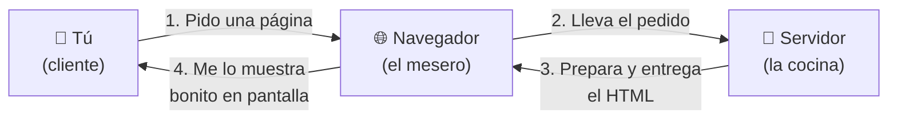
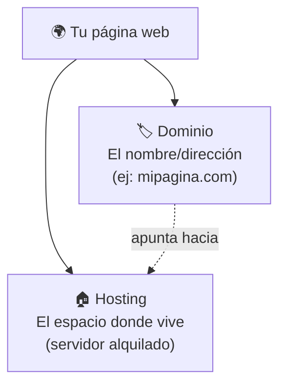
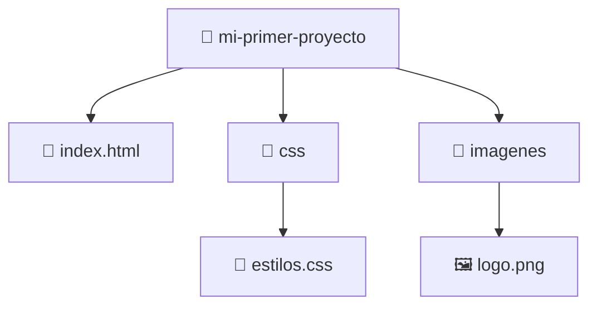
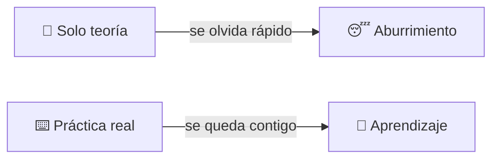
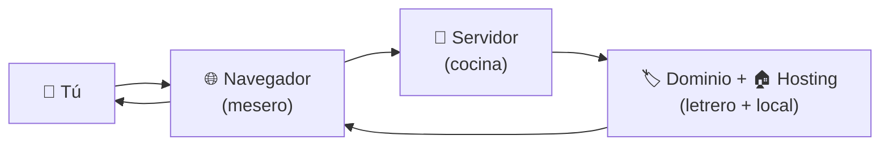

# 📘 MÓDULO 1 — Introducción al Mundo Web

> **Objetivo del módulo:** Entender qué es Internet y cómo funciona una página web… sin que tu cerebro pida vacaciones.

Antes de escribir una sola línea de código, necesitas entender **dónde va a vivir** lo que construyas. Es como aprender a cocinar: primero conoces la cocina, los utensilios y de dónde sale la comida. Aquí vamos a conocer "la cocina de Internet".

A lo largo de todo el módulo usaremos **una sola gran metáfora**: 🍽️ **Internet funciona como pedir comida en un restaurante.** Si entiendes el restaurante, entiendes la web.

---

## 🌍 ¿Qué es una página web?

Una página web es, sencillamente, **un documento que tu navegador sabe leer y mostrar bonito**. Parecido a un documento de Word, pero pensado para verse en Internet y para que cualquiera en el mundo pueda abrirlo.

Ese documento está escrito en un idioma llamado **HTML**, y eso es justo lo que vas a aprender a escribir. Tranquilo: no se memoriza, se practica.

### Diferencia entre sitio web y aplicación web

Mucha gente usa estas palabras como si fueran lo mismo, pero hay una diferencia sencilla.

Un **sitio web** es como un **periódico o un folleto**: tú lo lees, miras la información y poco más. Lees, navegas entre páginas y ya. Ejemplos típicos son un blog, la página de un restaurante o una página informativa de una empresa.

Una **aplicación web** es como una **cocina interactiva**: tú haces cosas, el sistema responde, guarda tu información y reacciona a lo que tocas. Ejemplos son Gmail (escribes y envías correos), Netflix (eliges y reproduces) o tu banco en línea (mueves dinero).

|Característica|📄 Sitio web|⚙️ Aplicación web|
|---|---|---|
|Qué haces|Lees y miras|Interactúas y creas cosas|
|Ejemplo|Un blog, una página informativa|Gmail, Netflix, tu banco|
|Metáfora|Un folleto que lees|Una máquina que usas|

La buena noticia: **toda aplicación web empieza siendo un sitio web**. Aprenderás lo básico primero, y eso es la base de todo lo demás.

### ¿Qué hace un navegador?

El **navegador** es el programa que usas para entrar a Internet: Chrome, Firefox, Edge, Safari. Su trabajo es **leer ese documento HTML y mostrártelo de forma visual y entendible.**

En la metáfora del restaurante, el navegador es **el mesero** 🧑‍🍳. Tú le pides algo ("quiero ver YouTube"), él va a la cocina, lo trae y te lo sirve en la mesa ya bien presentado. Tú nunca entras a la cocina; el mesero hace ese viaje por ti.

Dicho técnico: el navegador toma el código (que es feo y lleno de símbolos) y lo convierte en algo bonito: textos, botones, imágenes y colores.

### ¿Qué es un servidor?

Un **servidor** es simplemente **otra computadora**, normalmente muy potente, que está encendida las 24 horas guardando páginas web y entregándolas a quien las pida.

En el restaurante, el servidor es **la cocina** 🍳. Ahí está guardada toda la comida (las páginas web) y desde ahí se preparan y se entregan los pedidos. No importa cuántas personas pidan; la cocina atiende a todos.

Cuando alguien dice "se cayó el servidor", es como decir "se cerró la cocina": nadie puede recibir su pedido aunque el mesero esté disponible.

### ¿Cómo viaja una página por Internet?

Aquí juntamos todo. Cuando escribes una dirección y pulsas Enter, ocurre un pequeño viaje en milisegundos:



Paso a paso, sin tecnicismos:

1. **Tú** pides una página (escribes `youtube.com` y das Enter).
2. **El navegador** (mesero) toma tu pedido y lo lleva hasta el servidor.
3. **El servidor** (cocina) busca esa página, la prepara y se la entrega de vuelta al navegador.
4. **El navegador** te la muestra bonita en la pantalla.

Todo esto pasa en **menos de un segundo**, miles de veces al día, sin que lo notes.

### ¿Qué es un dominio y un hosting?

Estas dos palabras suenan complicadas, pero con la metáfora se entienden al instante.

El **dominio** es la **dirección del restaurante**: `google.com`, `netflix.com`, `tudominio.com`. Es el nombre fácil de recordar que escribes para llegar. Sin él, tendrías que memorizar una larga fila de números (la dirección real, llamada IP).

El **hosting** es **el local donde vive el restaurante**: el espacio físico (en realidad, espacio en un servidor) que alquilas para guardar tu página web y que esté disponible siempre.



Resumen de la metáfora completa: **el dominio es el letrero con el nombre, y el hosting es el local.** Pagas por ambos, igual que pagas por el nombre de tu negocio y por el local donde lo abres.

---

## 🛠 Herramientas necesarias

No necesitas comprar nada ni tener una computadora cara. Solo dos cosas: **un editor de código** y **un navegador**. Las dos son gratis.

### Instalar VSCode

**VSCode** (Visual Studio Code) es el programa donde vas a **escribir tu código**. Es como tu cuaderno digital, pero un cuaderno inteligente: te corrige, te sugiere y te colorea las cosas para que entiendas mejor lo que escribes.

Para instalarlo:

1. Entra a `https://code.visualstudio.com`
2. Descarga la versión para tu sistema (Windows, Mac o Linux).
3. Instálalo como cualquier otro programa (siguiente, siguiente, listo).

> 💡 **No te abrumes con los mil botones.** Al inicio solo usarás una pequeña parte. Nadie usa VSCode al 100%, ni los profesionales.

### Navegadores recomendados

Cualquiera sirve, pero para aprender recomendamos **Google Chrome** o **Firefox**, porque tienen las mejores herramientas para inspeccionar páginas (lo veremos en un momento). Lo ideal es tener al menos uno de estos instalado para seguir el curso sin problemas.

### Organización de carpetas

Antes de programar, hay un hábito que te ahorrará dolores de cabeza: **mantener tus archivos ordenados**. Es como tener tu escritorio limpio antes de empezar a trabajar.

Una estructura sencilla para empezar se ve así:



La idea es simple: una **carpeta principal** para tu proyecto, y dentro, todo organizado por tipo. El archivo `index.html` siempre será **la puerta de entrada** de tu sitio (el navegador lo busca primero por defecto).

### Crear archivos HTML

Crear tu primer archivo es facilísimo:

1. Abre VSCode.
2. Crea una carpeta para tu proyecto.
3. Crea un archivo nuevo y nómbralo `index.html` (la terminación `.html` es lo que importa).
4. Escribe algo dentro y ábrelo en tu navegador.

Tu primerísima página puede ser tan simple como esto:

```html
<h1>¡Hola, mundo!</h1>
<p>Esta es mi primera página web.</p>
```

Si abres ese archivo en el navegador, verás un título grande y un párrafo. **¡Felicidades, acabas de crear una página web!** Sí, así de sencillo empieza todo.

---

## 🔎 DevTools desde el primer día

Las **DevTools** (Herramientas de Desarrollador) son una "ventana secreta" que trae todo navegador para ver **cómo está hecha cualquier página** del mundo. Es como tener rayos X para ver el esqueleto de los sitios web.

### ¿Cómo inspeccionar páginas reales?

Pruébalo ahora mismo:

1. Abre cualquier página (por ejemplo, tu red social favorita).
2. Haz **clic derecho** sobre cualquier elemento.
3. Selecciona **"Inspeccionar"**.
4. Se abrirá un panel lleno de código: ¡ese es el HTML y CSS reales de la página!

### Ver el HTML y CSS de sitios populares

Esto es oro puro para aprender. Puedes abrir las DevTools en Wikipedia, Amazon o cualquier sitio y ver exactamente cómo construyeron sus títulos, botones y menús. Incluso puedes **cambiar el texto temporalmente** (solo en tu pantalla, no afectas la página real) y ver qué pasa.

> 🎮 **Truco divertido:** Inspecciona un titular de un periódico, cambia el texto y toma captura. Es inofensivo y te ayuda a perder el miedo a "tocar" el código.

### Introducción a las herramientas del navegador

Las DevTools tienen muchas pestañas, pero al inicio solo te importan dos:

|Pestaña|Para qué sirve|Metáfora|
|---|---|---|
|**Elements** (Elementos)|Ver y modificar el HTML y CSS|El plano de la casa|
|**Console** (Consola)|Ver errores y mensajes|El tablero de avisos|

No necesitas dominar las demás todavía. Las irás descubriendo cuando las necesites.

---

## 🧠 Cómo aprender programación sin frustrarse

Esta es quizá **la parte más importante de todo el módulo**. La mayoría de las personas no abandonan la programación porque sea difícil, sino por frustración mal entendida. Vamos a desmontar los mitos.

### Nadie memoriza HTML completo

Repite esto: **nadie**, ni el programador más experto del planeta, se sabe todas las etiquetas de memoria. Programar **no es memorizar**, es **entender y consultar**. Es como cocinar: no te aprendes todas las recetas, sabes dónde buscarlas y cómo combinarlas.

### Googlear es normal (y obligatorio)

Buscar en Google "cómo centrar un texto en HTML" no es hacer trampa: **es exactamente lo que hacen los profesionales todos los días.** Saber buscar bien es una de las habilidades más valiosas que vas a desarrollar.

### Equivocarse es parte del proceso

Tu código **se va a romper**. Muchas veces. Y está perfecto. Cada error es una pista, no un fracaso. La consola del navegador incluso te dice qué salió mal para que lo arregles. Equivocarse no es retroceder; es así como se aprende de verdad.

### La práctica vale más que la teoría

Puedes leer cien tutoriales y no aprender nada si nunca escribes código. **Una hora practicando vale más que diez horas leyendo.** Por eso este curso te empuja a construir desde el primer día.



---

## 📝 Resumen del Módulo 1

Si te quedas con una sola imagen de todo esto, que sea la del restaurante:



En pocas palabras, hoy aprendiste que: una **página web** es un documento que el navegador muestra bonito; el **navegador** es el mesero que trae lo que pides; el **servidor** es la cocina donde viven las páginas; el **dominio** es la dirección y el **hosting** es el local; y para empezar solo necesitas **VSCode y un navegador**. Además, las **DevTools** te dejan espiar cómo está hecho cualquier sitio, y lo más importante: **se aprende practicando, googleando y equivocándose**, no memorizando.

> 🚀 **Siguiente paso:** En el próximo módulo dejamos la teoría y empezamos a escribir HTML de verdad. Ya tienes la cocina lista; ahora vamos a cocinar.