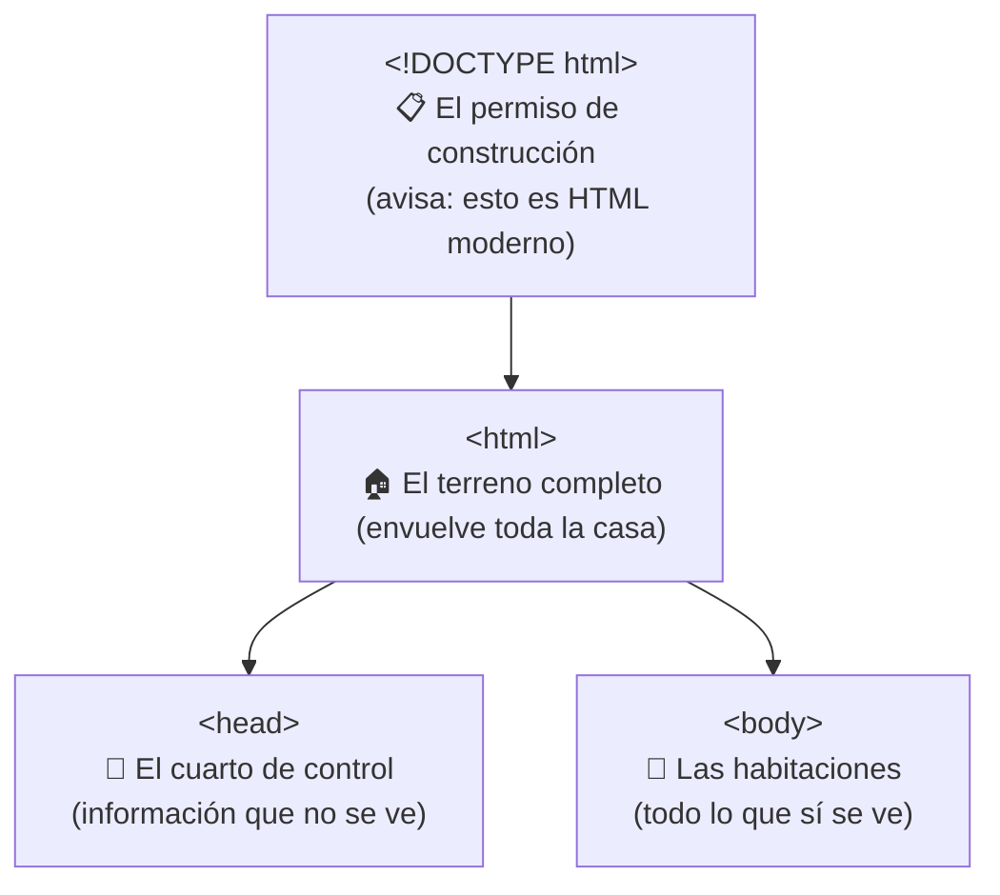
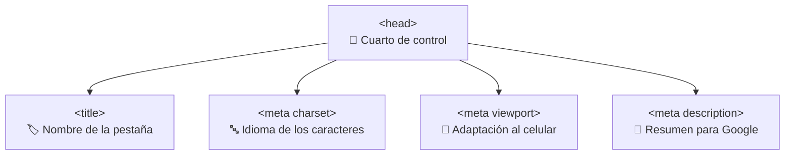
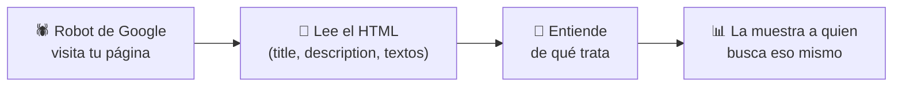
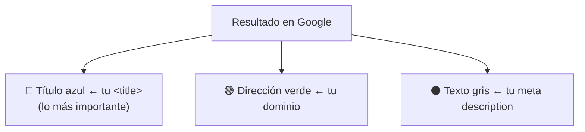
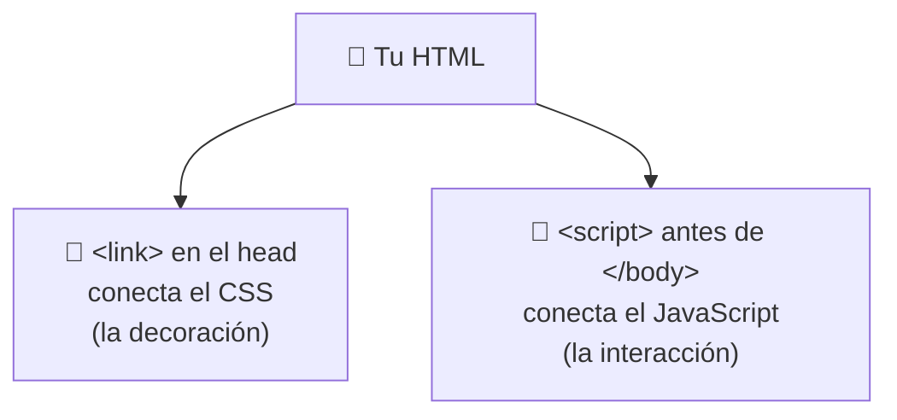
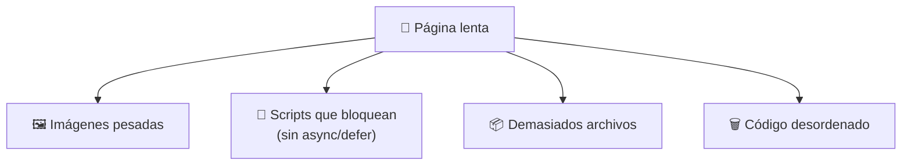
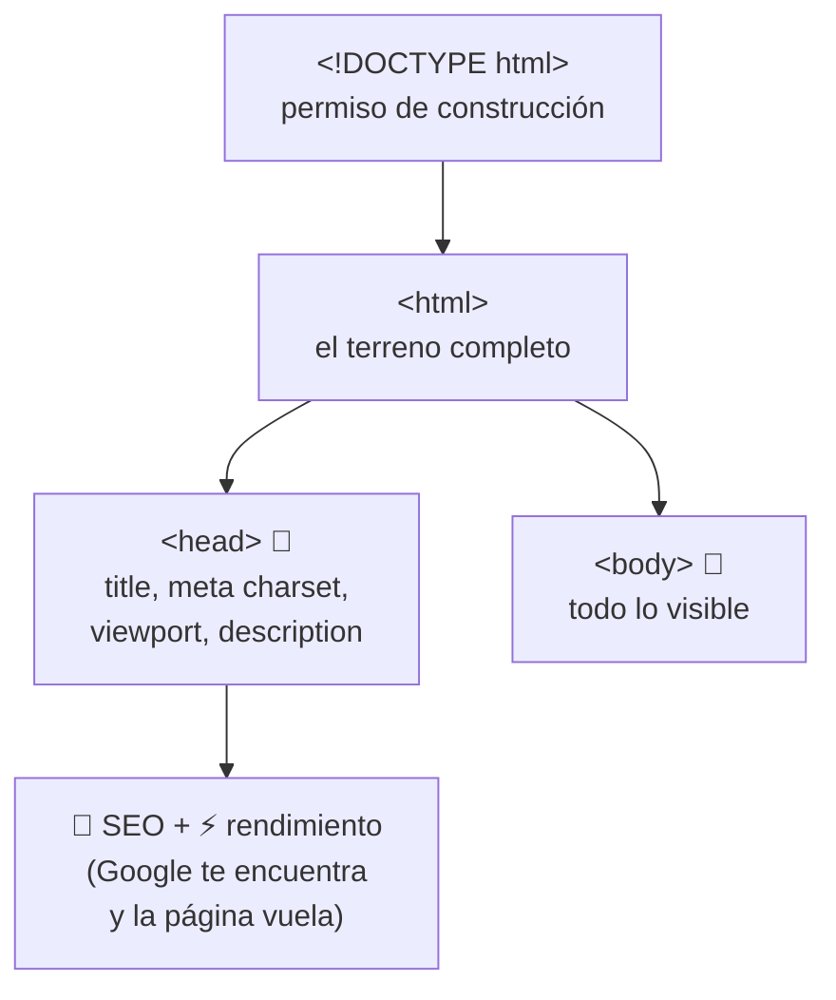

# 📕 MÓDULO 4 — La Estructura Base de Toda Web

> **Objetivo del módulo:** Aprender el esqueleto correcto de cualquier página HTML… ese "molde" que se repite en absolutamente todos los sitios del mundo.

En el Módulo 2 escribiste tu primer "Hola Mundo" y viste algunas etiquetas misteriosas como `<head>` y `<body>`. Hoy desciframos ese molde completo. La buena noticia: **siempre es el mismo**. Una vez que lo entiendes, lo escribes con los ojos cerrados.

La metáfora de este módulo: 🏠 **la estructura base de HTML es como los cimientos y planos de toda casa.** No importa si construyes una cabaña o una mansión: todas necesitan cimientos, paredes y un techo. En la web pasa igual.

---

## 🏗 Plantilla base HTML

Toda página web, desde Google hasta el blog más pequeño, comienza con la misma estructura de cuatro piezas. Esta es la plantilla que copiarás al inicio de cada proyecto:

```html
<!DOCTYPE html>
<html>
  <head>
    <!-- Información oculta de la página -->
  </head>
  <body>
    <!-- Todo lo que se ve en pantalla -->
  </body>
</html>
```

Veamos cada pieza con su metáfora. Piensa en construir una casa:



### `<!DOCTYPE html>`

Es la **primera línea** de toda página y le avisa al navegador: "oye, esto está escrito en HTML moderno, interprétalo bien". Es como el **permiso de construcción** que presentas antes de empezar a edificar: un trámite rápido pero obligatorio. No envuelve nada, solo se escribe una vez al inicio.

### `<html>`

Es el **contenedor más grande**, el que envuelve absolutamente todo lo demás. Es el **terreno** sobre el que se construye la casa entera. Todo lo que escribas vivirá dentro de su apertura `<html>` y su cierre `</html>`.

### `<head>`

Es el **cuarto de control** de la página: contiene información importante que el usuario **no ve directamente**, pero que el navegador y Google sí leen. Aquí van el título de la pestaña, la configuración de idioma, los enlaces a estilos, etc. Es como el cuarto de máquinas de un edificio: nadie lo visita, pero hace que todo funcione.

### `<body>`

Es **todo lo que sí se ve**: textos, imágenes, botones, videos, menús… Las **habitaciones donde vive la gente**. Cuando alguien abre tu página, lo que mira es el contenido del `<body>`. Aquí pasarás la mayor parte de tu tiempo construyendo.

> 💡 **Truco para recordar:** `head` = "cabeza" (piensa, configura, no se ve) y `body` = "cuerpo" (es lo visible, lo que se toca). La cabeza decide, el cuerpo muestra.

---

## 🧠 El poder del `<head>`

El `<head>` parece aburrido porque no se ve… pero es donde ocurren cosas muy poderosas. Aquí defines cómo te encuentra Google, cómo se ve tu página en el celular y qué dice la pestaña del navegador. Veamos sus etiquetas estrella.



### `<title>`

Define el **nombre que aparece en la pestaña** del navegador (y el título azul que ves en los resultados de Google). Es lo primero que la gente lee de tu sitio.

```html
<title>Pastelería Dulce Hogar - Tortas artesanales</title>
```

Es como el **letrero de tu tienda**: si está vacío o dice "Documento sin título", nadie sabe qué vendes. Más adelante veremos por qué este es **el rey del SEO**.

### `<meta charset>`

Define el **conjunto de caracteres** que usa tu página. En cristiano: hace que las **tildes, las ñ y los emojis** se vean bien y no salgan como símbolos raros (`ñ` en vez de `ñ`). Casi siempre se escribe así:

```html
<meta charset="UTF-8">
```

Es como decirle al navegador en qué **idioma de símbolos** estás escribiendo. Sin él, tu español lleno de tildes podría verse roto. Es pequeñito pero indispensable.

### `<meta viewport>`

Hace que tu página **se adapte a la pantalla del celular**. Sin esta línea, tu sitio se vería diminuto en un móvil, como una página de escritorio encogida. Con ella, se ajusta cómodamente. Se escribe así (cópiala tal cual, es estándar):

```html
<meta name="viewport" content="width=device-width, initial-scale=1.0">
```

> 📱 **Metáfora:** es como la ropa elástica que se ajusta a cualquier cuerpo. La misma página "estira o encoge" para verse bien en un celular, una tablet o un monitor grande.

### `<meta description>`

Es un **resumen corto de tu página** que Google muestra debajo del título en los resultados de búsqueda. No se ve dentro de la página, pero influye en que la gente decida hacer clic o no.

```html
<meta name="description" content="Tortas artesanales hechas con amor en Bucaramanga. Pide la tuya hoy.">
```

Es como la **contraportada de un libro**: ese textito que lees para decidir si vale la pena entrar. Un buen resumen invita; uno vacío se pierde entre la multitud.

---

## 🚀 Introducción al SEO real

**SEO** significa "optimización para motores de búsqueda". En simple: **es todo lo que haces para que Google entienda tu página y la muestre a la gente correcta.** No es magia ni trucos secretos; empieza con escribir bien tu HTML.

### Cómo Google entiende una página

Google usa robots (los llaman "arañas" o _crawlers_) que **leen tu HTML** igual que lo lee el navegador, pero buscando entender de qué trata tu página. Leen tu `<title>`, tu `<meta description>`, tus títulos y tu contenido para clasificarte.



Por eso un HTML ordenado y bien escrito **no es solo cuestión de estética**: es lo que hace que te encuentren. Le estás dando a Google las pistas para saber a quién mostrarte.

### Por qué el `<title>` es tan importante

El `<title>` es la **pista número uno** que usa Google. Es lo primero que lee y lo más visible en los resultados de búsqueda: ese enlace azul en el que la gente hace clic. Un buen título puede ser la diferencia entre que te visiten o que te ignoren.



### Cómo escribir títulos correctos

Un buen título es **claro, específico y describe de verdad la página**. Compara:

|❌ Título débil|✅ Título fuerte|
|---|---|
|`Inicio`|`Pastelería Dulce Hogar - Tortas artesanales en Bucaramanga`|
|`Documento sin título`|`Curso de HTML para principiantes - Aprende desde cero`|
|`Página 1`|`10 recetas fáciles de pan casero - Cocina Simple`|

Tres consejos de oro: sé **específico** (di exactamente qué ofreces), pon **lo más importante al inicio** (Google y la gente le dan más peso a las primeras palabras), y mantenlo en un **largo razonable** (ni una sola palabra, ni un párrafo entero). Piensa en el título como el titular de una noticia: debe decirte de qué va antes de que entres.

---

## ⚡ Rendimiento básico

Recuerda del Módulo 3 que una página rápida es una página ligera y ordenada. Aquí veremos cómo **conectar** los archivos de estilo (CSS) y de interacción (JavaScript) sin que tu página cargue lento.

### Cómo enlazar CSS y JavaScript

Tu HTML es la estructura, pero el diseño (CSS) y la interacción (JavaScript) suelen vivir en **archivos separados** que debes "conectar". Es como enchufar la electricidad y el agua a una casa ya construida.

El **CSS** se enlaza en el `<head>`:

```html
<head>
  <link rel="stylesheet" href="estilos.css">
</head>
```

El **JavaScript** se enlaza normalmente al final, justo antes de cerrar el `<body>`:

```html
<body>
  <!-- todo el contenido -->
  <script src="script.js"></script>
</body>
```



> 💡 **¿Por qué el JavaScript va al final?** Porque así el navegador primero muestra el contenido y _después_ carga las funciones. El usuario ve la página rápido en lugar de quedarse mirando una pantalla en blanco esperando.

### Diferencia entre `async` y `defer`

Cuando enlazas JavaScript, existen dos "palabras mágicas" que controlan **cuándo** se ejecuta el código sin frenar la carga de la página. No te agobies: solo necesitas la idea general.

Imagina que el navegador está leyendo tu HTML de arriba a abajo, como quien lee un libro. Cuando se topa con un `<script>`, tiene que decidir qué hacer:

|Modo|Qué hace|Metáfora|
|---|---|---|
|**(normal)**|Se detiene, carga el script y luego sigue|Dejar de leer para atender una llamada|
|**`async`**|Carga el script en paralelo y lo ejecuta **apenas esté listo**|Un mensajero que interrumpe en cuanto llega|
|**`defer`**|Carga en paralelo pero **espera al final** para ejecutar|Un mensajero educado que espera a que termines de leer|

```html
<script src="script.js" defer></script>
```

Para la mayoría de los casos, **`defer` es la opción más segura y recomendada**: deja que la página se muestre completa y luego activa el JavaScript en orden. No tienes que memorizar esto ahora; solo recuerda que **`defer` es tu amigo** cuando empieces.

### Por qué algunas páginas cargan lento

Juntando todo lo del módulo, estas son las causas más comunes de una página lenta:



Las **imágenes pesadas** siguen siendo la causa número uno (como vimos en el Módulo 3). Los **scripts mal colocados** que frenan la carga son otra causa frecuente, y por eso aprendimos a ponerlos al final o usar `defer`. Sumar **demasiados archivos** y tener **código desordenado** completa la lista. La lección de fondo no cambia: **menos peso y mejor orden = más velocidad.**

---

## 🔬 Compruébalo tú mismo

Abre cualquier sitio que te guste, haz **clic derecho → Inspeccionar** y busca la sección `<head>`. Verás su `<title>`, sus etiquetas `<meta>` y sus enlaces a CSS y JavaScript: exactamente las piezas que aprendiste hoy, funcionando en una página real. Es la mejor forma de comprobar que esta estructura **se repite en todas partes**.

---

## 📝 Resumen del Módulo 4



En resumen, hoy aprendiste el **molde universal** de toda página: `<!DOCTYPE html>` (el permiso), `<html>` (el terreno), `<head>` (el cuarto de control invisible) y `<body>` (todo lo visible). Dentro del `<head>` viven etiquetas poderosas: el `<title>` (el letrero de tu tienda y rey del SEO), `<meta charset>` (para que las tildes y ñ se vean bien), `<meta viewport>` (para adaptarse al celular) y `<meta description>` (la contraportada que Google muestra). Entendiste que el **SEO** empieza con un HTML claro que los robots de Google puedan leer, y que el **rendimiento** mejora enlazando bien el CSS y el JavaScript, usando `defer` como opción segura y manteniendo la página ligera.

> 🚀 **Siguiente paso:** Ya dominas el esqueleto de cualquier web. Ahora que tienes los cimientos, en el próximo módulo empezaremos a llenar el `<body>` con contenido real: títulos, párrafos, listas, imágenes y enlaces. ¡Hora de amueblar la casa!