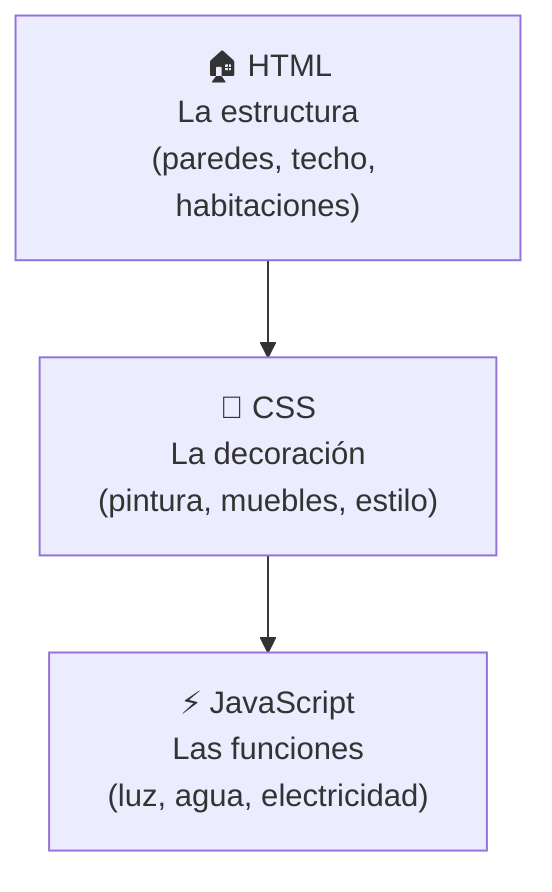
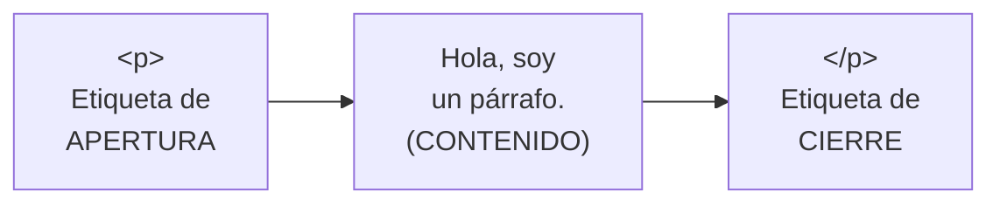
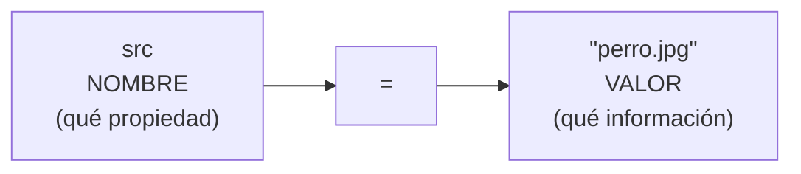
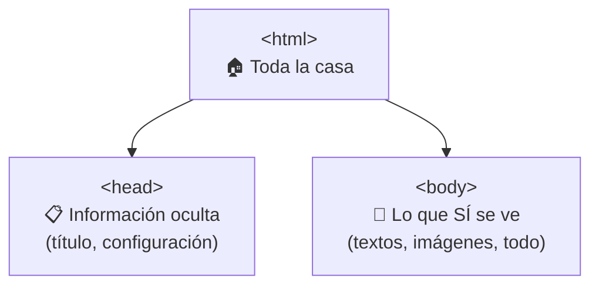
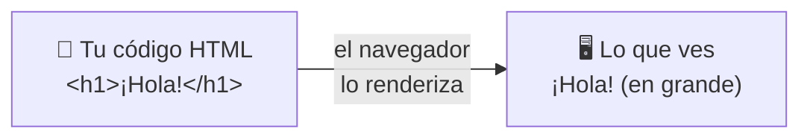
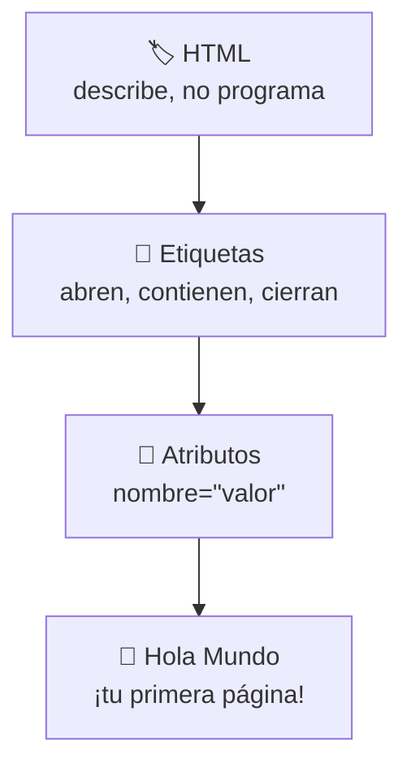

# 📗 MÓDULO 2 — Primeros Pasos con HTML

> **Objetivo del módulo:** Perderle el miedo al código y entender las etiquetas… descubriendo que son mucho más amigables de lo que parecen.

En el Módulo 1 conocimos "la cocina de Internet". Ahora vamos a entrar a ella y empezar a cocinar. Aquí escribirás tu primer código de verdad y, lo más importante, vas a comprobar con tus propios ojos que **HTML no muerde**.

La metáfora de este módulo es muy visual: 🏠 **escribir HTML es como construir una casa con bloques de LEGO etiquetados.** Cada pieza tiene un nombre y un lugar. Si entiendes los bloques, entiendes HTML.

---

## 🏷 ¿Qué es HTML?

HTML significa _HyperText Markup Language_ (Lenguaje de Marcado de Hipertexto). Suena intimidante, pero quédate solo con una palabra: **marcado**. HTML sirve para **marcar** las partes de un documento y decir qué es cada cosa: "esto es un título", "esto es un párrafo", "esto es una imagen".

### Por qué HTML no es un lenguaje de programación

Esto sorprende a mucha gente, pero es liberador: **HTML no programa, HTML describe.**

Un lenguaje de programación **toma decisiones**: hace cálculos, repite tareas, reacciona ("si pasa esto, haz aquello"). HTML no hace nada de eso. HTML solo **dice qué es cada cosa y en qué orden va.** No piensa, no decide, no calcula.

Piensa en la diferencia así: HTML es como **escribir una lista del supermercado** (solo describes qué quieres), mientras que programar de verdad sería como **cocinar la receta tomando decisiones sobre la marcha** (si falta sal, le pones; si hierve, bajas el fuego).

||🏷️ HTML|🧠 Lenguaje de programación|
|---|---|---|
|Qué hace|Describe y organiza|Decide y calcula|
|Ejemplo cotidiano|Una lista de tareas|Un robot que cumple esas tareas|
|¿Toma decisiones?|No|Sí|

> 💡 **¿Por qué es buena noticia?** Porque significa que HTML es de las cosas más fáciles del mundo tech para empezar. No hay lógica complicada; solo aprendes a nombrar las partes.

### HTML como la estructura de una casa

Esta es la metáfora que vas a usar todo el tiempo. Una página web se construye en capas, igual que una casa:



En esta etapa solo nos ocupamos de la **estructura (HTML)**: levantar las paredes y definir las habitaciones. Una casa sin pintura sigue siendo una casa; pero sin estructura, no hay nada. Por eso HTML es lo primero y lo más importante de aprender.

---

## 🔧 Anatomía de una etiqueta

Aquí está el corazón de HTML. Casi todo en HTML son **etiquetas**, y todas siguen el mismo patrón sencillo. Si entiendes una, las entiendes casi todas.

### Etiquetas de apertura y cierre

La mayoría de las etiquetas vienen **en pareja**: una que abre y una que cierra. Funcionan como **un abrazo** que envuelve el contenido 🤗.

```html
<p>Hola, soy un párrafo.</p>
```

Desglosémoslo:



La etiqueta de cierre es **idéntica a la de apertura, pero con una barra `/`**. Esa barrita es la que dice "aquí termina". Es como abrir y cerrar un paréntesis: lo que abres, lo cierras.

> 🧱 **Metáfora del bloque:** la etiqueta de apertura es la tapa de arriba de una caja, el cierre es la tapa de abajo, y el contenido es lo que guardas dentro.

### El contenido

El **contenido** es simplemente **lo que va en medio** de las dos etiquetas: el texto que quieres mostrar, una imagen, otras etiquetas, etc.

```html
<h1>Este texto es el contenido del título</h1>
<p>Y este es el contenido del párrafo.</p>
```

Lo que escribas entre la apertura y el cierre es lo que el navegador mostrará en pantalla. Cambia el contenido y cambia lo que ve el usuario. Así de directo.

### Etiquetas autocerradas

No todas las etiquetas necesitan pareja. Algunas **se cierran solas** porque no envuelven nada: simplemente _colocan_ algo en la página, como una imagen o un salto de línea.

```html

<br>
<hr>
```

Estas etiquetas son como **un sello o una estampa** 📍: la pones una vez y ya está, no necesita un "fin". No hay nada que envolver, así que no hay etiqueta de cierre.

|Tipo|Necesita cierre|Ejemplo|Para qué sirve|
|---|---|---|---|
|Normal (en pareja)|Sí|`<p>...</p>`|Envolver texto o contenido|
|Autocerrada|No|``, `<br>`|Colocar un elemento suelto|

---

## 🎨 Atributos y valores

Las etiquetas solas hacen lo básico, pero a veces necesitamos darles **información extra**. Para eso existen los **atributos**.

### ¿Qué son los atributos?

Un atributo es **información adicional que le das a una etiqueta** para que haga mejor su trabajo. Van **siempre dentro de la etiqueta de apertura**.

Piénsalo así: la etiqueta dice _qué_ es algo, y el atributo da los _detalles_. Si una etiqueta `` dice "aquí va una imagen", el atributo dice **cuál** imagen exactamente.

```html

```

En este ejemplo, `` es la etiqueta, y tiene dos atributos: `src` (dónde está la imagen) y `alt` (un texto que describe la imagen). Es como pedir una pizza: "pizza" es la etiqueta, y "tamaño grande, con extra queso" son los atributos.

### Anatomía de un atributo

Un atributo siempre tiene dos partes: un **nombre** y un **valor**, unidos por un `=`.



Se lee como una frase: "el atributo `src` **es igual a** `perro.jpg`". Nombre, igual, valor. Siempre el mismo patrón.

### Uso de comillas

El **valor siempre va entre comillas** `" "`. Esto no es opcional ni un capricho: las comillas le dicen al navegador "esto es el valor, todo lo que está aquí dentro es uno solo".

```html
<!-- ✅ Correcto -->
<a href="https://google.com">Ir a Google</a>

<!-- ❌ Incorrecto (sin comillas) -->
<a href=https://google.com>Ir a Google</a>
```

> 🎁 **Metáfora:** las comillas son como el **papel que envuelve un regalo**: agrupan el contenido para que se entienda que todo eso va junto, como una sola cosa.

### Cómo escribir atributos correctamente

Junta todo lo aprendido y tendrás la fórmula. Un atributo bien escrito sigue siempre esta estructura:

```html
<etiqueta nombre="valor">contenido</etiqueta>
```

Tres reglas de oro para no equivocarte:

1. El atributo va **dentro** de la etiqueta de apertura, nunca en la de cierre.
2. El valor **siempre** entre comillas.
3. Si hay varios atributos, se **separan con un espacio** (no con comas).

```html

```

Aquí hay tres atributos (`src`, `alt`, `width`), cada uno con su valor entre comillas, separados por espacios. Una vez que ves el patrón, lo reconoces para siempre.

---

## 👋 Tu primer "Hola Mundo"

Llegó el momento de la verdad. Vas a crear y ver tu primera página web real. Este es el ritual de iniciación de **todo** programador del planeta. Bienvenido al club.

### Paso 1: Crear el archivo HTML

Abre VSCode, crea una carpeta para tu proyecto y dentro un archivo llamado `index.html`. Escribe esto:

```html
<!DOCTYPE html>
<html>
  <head>
    <title>Mi primera página</title>
  </head>
  <body>
    <h1>¡Hola, Mundo!</h1>
    <p>Esta es mi primera página web. ¡La hice yo!</p>
  </body>
</html>
```

No te asustes con las etiquetas nuevas. Esta es la **estructura básica de toda página** y solo tiene tres partes que entender:



En palabras simples: `<html>` envuelve toda la casa; `<head>` guarda información que el usuario no ve directamente (como el título de la pestaña); y `<body>` es **todo lo que sí aparece** en la pantalla. El contenido importante para empezar va dentro de `<body>`.

### Paso 2: Abrirlo en el navegador

Guarda el archivo (Ctrl + S). Luego búscalo en tu carpeta y **haz doble clic** sobre `index.html`. Se abrirá en tu navegador y verás tu título y tu párrafo en pantalla.

🎉 **¡Eso es! Acabas de crear y publicar una página web en tu propia computadora.**

### Paso 3: Entender cómo se renderiza

"Renderizar" es solo una palabra elegante para decir **"convertir el código en algo visual"**. Es justo el trabajo del navegador (recuerda: el mesero que trae el plato bien presentado).



Tú escribes etiquetas (que se ven feas, llenas de símbolos), y el navegador las **traduce** a algo bonito: títulos grandes, párrafos ordenados, imágenes en su lugar. Tú no tienes que dibujar nada; solo describes con etiquetas y el navegador hace el dibujo.

> 🔬 **Pruébalo tú:** cambia el texto entre `<h1>` y `</h1>`, guarda, y recarga el navegador. Verás el cambio al instante. Eso es el ciclo completo de un desarrollador web: **escribir → guardar → ver → repetir.**

---

## 🧠 Recordatorio antifrustración

Antes de cerrar, un par de cosas que te van a pasar y son **completamente normales**:

Vas a olvidar cerrar una etiqueta y la página se verá rara. **Normal.** Vas a escribir mal el nombre de un atributo y algo no funcionará. **Normal.** Vas a copiar un ejemplo y no entenderlo del todo la primera vez. **También normal.** Nadie nació sabiendo esto, y cada error te enseña a mirar tu código con más atención. El truco no es no equivocarse, sino acostumbrarte a revisar con calma.

---

## 📝 Resumen del Módulo 2



En resumen, hoy aprendiste que: **HTML no es programación**, solo describe las partes de una página, como nombrar las habitaciones de una casa; las **etiquetas** casi siempre vienen en pareja (apertura y cierre) y envuelven un contenido, aunque algunas se **cierran solas** como ``; los **atributos** dan información extra y se escriben con la fórmula `nombre="valor"` con su valor siempre entre comillas; y construiste tu **primer "Hola Mundo"** entendiendo que el navegador **renderiza** (traduce) tu código en algo visual.

> 🚀 **Siguiente paso:** Ya sabes cómo funciona una etiqueta. En el próximo módulo aprenderás las etiquetas más útiles para crear títulos, párrafos, listas, enlaces e imágenes… y empezarás a construir páginas con contenido de verdad.