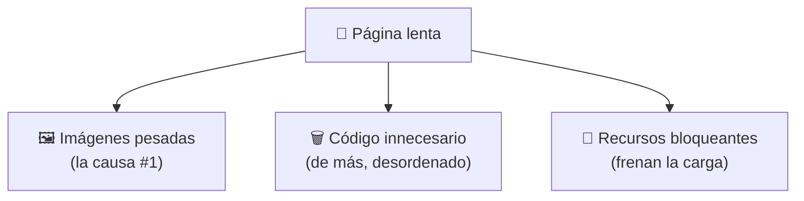
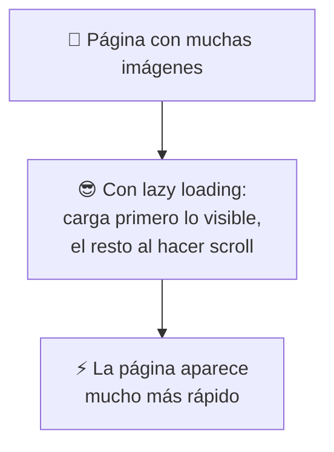
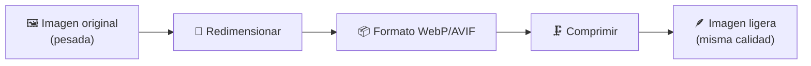
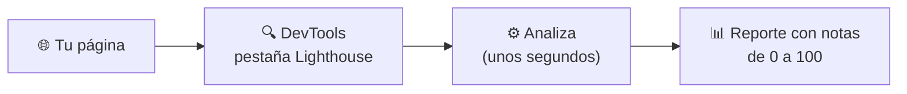
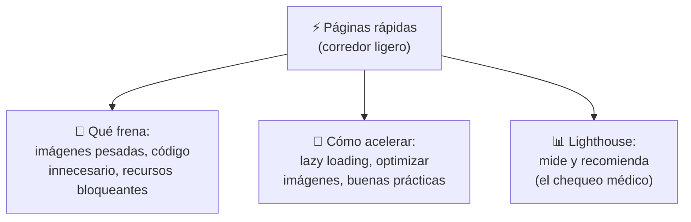

# ⚡ MÓDULO 11 — Rendimiento y Optimización

> **Objetivo del módulo:** Aprender cómo hacer páginas rápidas… porque una web lenta es una web que la gente abandona antes de verla.

A lo largo del curso fuimos dejando pistas sobre la velocidad: las imágenes pesadas (Módulo 3), `loading="lazy"` y los formatos modernos (Módulo 7), los scripts bloqueantes y `defer` (Módulo 4). Hoy juntamos todo en un solo lugar y le ponemos nombre y herramientas. Este módulo te enseña a que tus páginas **vuelen**.

¿Por qué importa tanto? Porque la gente es impaciente: si una página tarda más de 3 segundos en cargar, **buena parte de los visitantes se va** antes de ver nada. Y Google lo sabe: las páginas rápidas posicionan mejor (¿recuerdas el SEO del Módulo 4?).

La metáfora de este módulo: 🏃 **una página rápida es como un corredor ligero.** Un atleta no corre con una mochila llena de piedras. Cada cosa innecesaria que cargas (imágenes gigantes, código de más) es una piedra en la mochila que lo frena. Optimizar es **quitar piedras** para que tu página corra ligera hasta el usuario.

---

## ⚡ Qué hace lenta una página

Antes de acelerar, hay que entender qué frena. La velocidad de tu página depende de cuánto "peso" tiene que cargar y transportar el navegador. Estas son las tres piedras más comunes en la mochila.



### Imágenes pesadas

Son **la causa número uno** de la lentitud, y por eso las repetimos tanto en el curso. Una sola foto enorme puede pesar más que todo el resto de la página junta. Subir una imagen de 5000 píxeles para mostrarla en un espacio de 400 es como **enviar un piano cuando solo necesitabas un teclado**.

> 🖼️ **Recuerda:** una imagen pesada tarda en descargarse, y mientras tanto el usuario mira un espacio vacío. La buena noticia es que es el problema **más fácil de arreglar**, como veremos enseguida.

### Código innecesario

Todo el código que tu página carga —pero no usa— es peso muerto. Estilos que no se aplican, scripts que no hacen falta, librerías enormes para una tarea pequeña. Es como **mudarte cargando cajas de cosas que nunca vas a usar**: ocupan espacio y ralentizan todo el viaje.

> 🗑️ **Metáfora:** imagina llevar a un viaje de fin de semana TODA tu ropa "por si acaso". Más peso, más lento, más complicado. Lleva solo lo que vas a usar. Lo mismo con el código.

### Recursos bloqueantes

Un recurso "bloqueante" es un archivo (normalmente JavaScript o CSS) que **detiene la carga de la página** hasta que termina de procesarse. El navegador se queda esperándolo, y el usuario ve una pantalla en blanco mientras tanto.


> 🚧 **Metáfora:** un recurso bloqueante es como un **semáforo en rojo** en medio de tu carga: todo el tráfico se detiene hasta que cambia. Recuerda del Módulo 4 que por eso ponemos el JavaScript al final o usamos `defer`: para que no frene la fila.

---

## 🚀 Optimización básica

Ahora la parte divertida: **quitar las piedras de la mochila**. No necesitas técnicas avanzadas; con unos pocos hábitos ya logras páginas notablemente más rápidas.

### Lazy loading

El "lazy loading" (carga perezosa) hace que las imágenes **se carguen solo cuando el usuario está a punto de verlas**, no todas de golpe al inicio. Lo viste en el Módulo 7, y es de lo más fácil de aplicar:

```html

```



> 🍽️ **Recuerda la metáfora:** es el **buffet por plato**. No te sirven los 20 platos a la vez; te traen cada uno cuando vas a comerlo. Así la mesa (la pantalla) se ve lista al instante.

### Optimización de imágenes

Como las imágenes son la piedra más pesada, atacarlas da el mayor resultado. Tres gestos sencillos:

Primero, **redimensiona** antes de subir: ajusta la imagen al tamaño real en que se mostrará (no subas 4000px para un espacio de 400). Segundo, usa **formatos modernos** como WebP o AVIF (Módulo 7), que pesan mucho menos con la misma calidad. Tercero, **comprime** la imagen con herramientas gratuitas que reducen su peso sin que se note la diferencia a simple vista.



> 💡 **Dato práctico:** existen sitios web gratuitos donde arrastras una imagen y te la devuelven optimizada en segundos. No necesitas programas caros ni conocimientos técnicos para esto.

### Buenas prácticas

Más allá de las imágenes, estos hábitos mantienen tu página ligera y veloz. **Elimina el código que no usas** (estilos y scripts sobrantes). **Coloca el JavaScript al final** o usa `defer` para que no bloquee (Módulo 4). **No abuses de librerías enormes** para tareas pequeñas. Y **mantén tu código ordenado**, porque un código limpio no solo es más rápido, también es más fácil de mejorar después.

|Hábito|Qué evita|Módulo donde lo vimos|
|---|---|---|
|`loading="lazy"`|Cargar imágenes invisibles|Módulo 7|
|Formatos WebP/AVIF|Imágenes pesadas|Módulo 7|
|`defer` en scripts|Recursos bloqueantes|Módulo 4|
|Borrar código sin uso|Peso muerto|Este módulo|

> 🏃 **La regla de oro del rendimiento:** **menos peso = más velocidad.** Si recuerdas solo una frase de todo el módulo, que sea esta. Cada cosa que quitas de la mochila, tu página la agradece.

---

## 📊 Introducción a Lighthouse

¿Cómo sabes si tu página es rápida o lenta? No tienes que adivinar: existe una herramienta gratuita y oficial de Google llamada **Lighthouse** que **analiza tu página y te da una nota**, como un examen.

### Cómo analizar el rendimiento

Lighthouse viene **integrado en el navegador Chrome**, dentro de las DevTools que conoces desde el Módulo 1. Se usa así:

1. Abre tu página en Chrome.
2. Haz **clic derecho → Inspeccionar** para abrir las DevTools.
3. Busca la pestaña **"Lighthouse"**.
4. Pulsa **"Analyze"** (Analizar) y espera unos segundos.



Lighthouse te entrega un reporte con **calificaciones de 0 a 100** en varias áreas, no solo velocidad:

|Área|Qué mide|
|---|---|
|⚡ **Performance**|Qué tan rápido carga tu página|
|♿ **Accessibility**|Qué tan accesible es (¡Módulo 10!)|
|✅ **Best Practices**|Si sigues buenas prácticas modernas|
|🔍 **SEO**|Qué tan bien te entiende Google (Módulo 4)|

> 📊 **Metáfora:** Lighthouse es como el **chequeo médico de tu página**. Te dice qué está sano y qué necesita atención, con un número claro y, lo mejor de todo, **una lista de recomendaciones concretas** para mejorar. No te limita a decir "vas lento": te explica _por qué_ y _cómo_ arreglarlo.

Lo más valioso es justo esa lista de sugerencias: Lighthouse detecta tus imágenes pesadas, tu código bloqueante y tus problemas de accesibilidad, y te dice exactamente qué corregir. Es como tener un profesor revisando tu trabajo y dándote la guía para mejorar.

---

## 🔬 Compruébalo tú mismo

Abre Chrome, entra a cualquier página (¡incluso una tuya!) y ejecuta Lighthouse siguiendo los pasos de arriba. Mira las cuatro notas y, sobre todo, **lee la lista de recomendaciones**. Te sorprenderá ver que hasta sitios famosos tienen cosas por mejorar. Luego prueba con una página muy ligera y otra muy pesada (un periódico lleno de anuncios, por ejemplo) y compara las notas. Verás el rendimiento dejar de ser un concepto abstracto y volverse algo medible.

---

## 📝 Resumen del Módulo 11



En resumen, hoy aprendiste que una web rápida es un corredor sin piedras en la mochila. Las tres cosas que más la frenan son las **imágenes pesadas** (la causa #1), el **código innecesario** (peso muerto) y los **recursos bloqueantes** (el semáforo en rojo). Para acelerar, aplicas **lazy loading** (el buffet por plato), **optimizas imágenes** (redimensionar + formato moderno + comprimir) y sigues **buenas prácticas** como `defer` y borrar el código sin uso, recordando siempre la regla de oro: **menos peso = más velocidad**. Y descubriste **Lighthouse**, el chequeo médico gratuito de Google que mide tu rendimiento, accesibilidad, buenas prácticas y SEO, dándote una lista clara de qué mejorar.

> 🚀 **Siguiente paso:** Ahora tus páginas no solo están bien construidas, sino que **cargan rápido y puedes medirlas**. Tienes una visión completa de lo que hace a una web profesional: estructura, semántica, accesibilidad y rendimiento. ¡Sigamos sumando herramientas para que tus proyectos sean cada vez mejores!